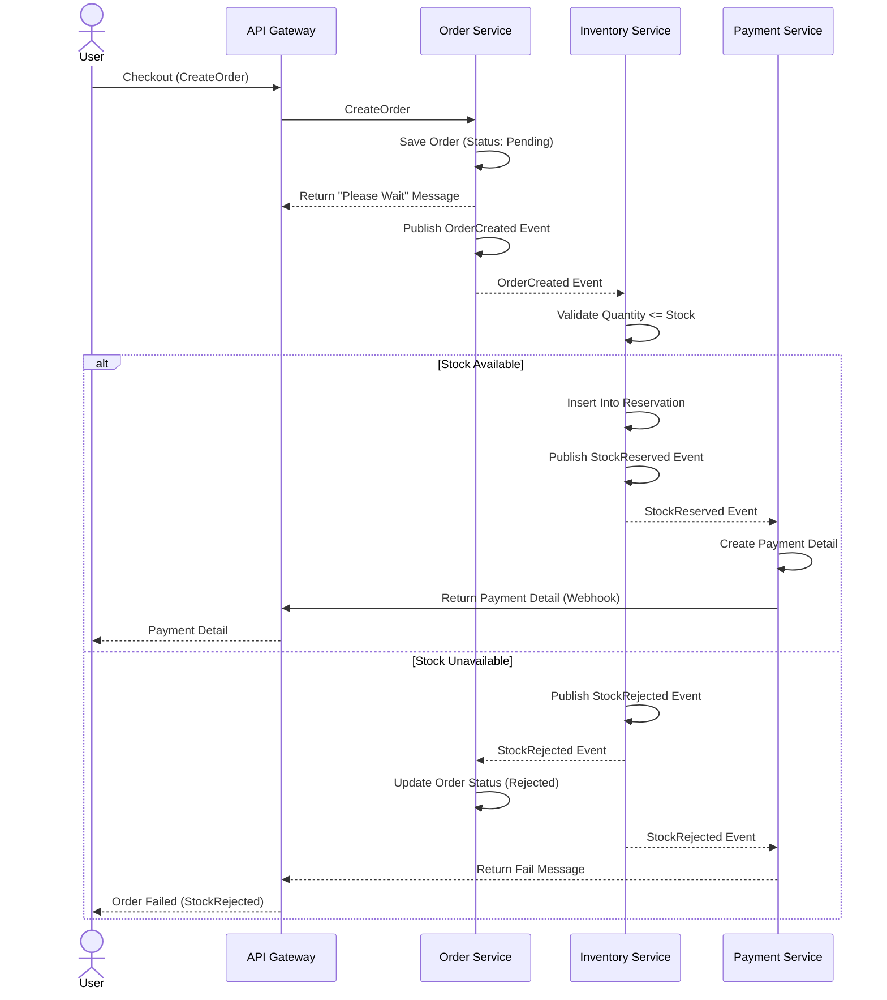

# Checkout Order - Sequence Diagram

```mermaid
sequenceDiagram
    actor User
    participant API as API Gateway
    participant Order as Order Service
    participant Inventory as Inventory Service
    participant Payment as Payment Service

    User->>API: Checkout (CreateOrder)
    API->>Order: CreateOrder
    Order->>Order: Save Order (Status: Pending)
    Order-->>API: Return "Please Wait" Message
    Order->>Order: Publish OrderCreated Event

    Order-->>Inventory: OrderCreated Event

    Inventory->>Inventory: Validate Quantity <= Stock

    alt Stock Available
        Inventory->>Inventory: Insert Into Reservation
        Inventory->>Inventory: Publish StockReserved Event
        Inventory-->>Payment: StockReserved Event
        Payment->>Payment: Create Payment Detail
        Payment->>API: Return Payment Detail (Webhook)
        API-->>User: Payment Detail
    else Stock Unavailable
        Inventory->>Inventory: Publish StockRejected Event
        Inventory-->>Order: StockRejected Event
        Order->>Order: Update Order Status (Rejected)
        Inventory-->>Payment: StockRejected Event
        Payment-->>API: Return Fail Message
        API-->>User: Order Failed (StockRejected)
    end
```
