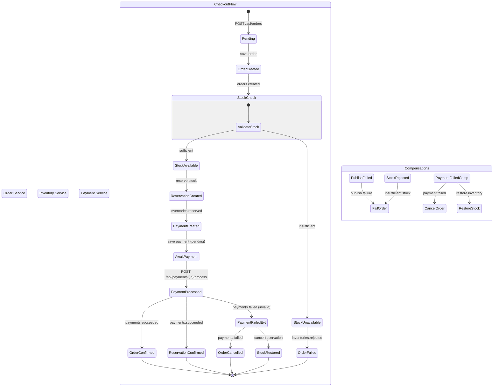

# Choreography Saga - Event Flow Diagram

## Event Catalog

| Event | Routing Key | Publisher | Consumers |
|---|---|---|---|
| OrderCreated | `orders.created` | Order Service | Inventory Service |
| StockReserved | `inventories.reserved` | Inventory Service | Payment Service |
| StockRejected | `inventories.rejected` | Inventory Service | Order Service |
| PaymentSucceeded | `payments.succeeded` | Payment Service | Order Service, Inventory Service |
| PaymentFailed | `payments.failed` | Payment Service | Order Service, Inventory Service |
