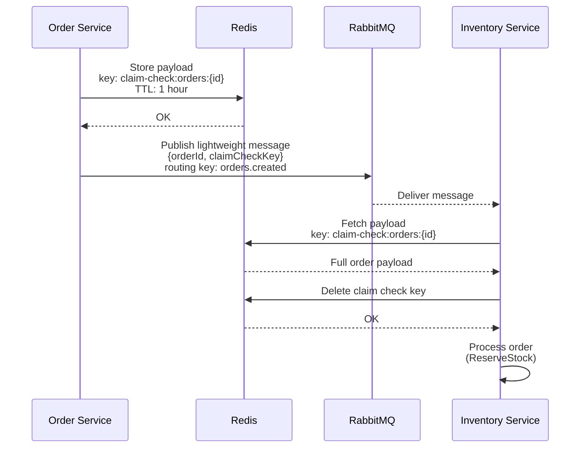

# Claim Check Pattern - Large Payload Optimization

## Why Claim Check

Order payloads contain multiple products with quantities. Rather than serializing
the full payload through RabbitMQ, the Order Service stores it in Redis and only
passes a lightweight reference message. The Inventory Service fetches the full
payload from Redis when it processes the message, then removes the key.

- **Storage**: Redis key `claim-check:orders:{orderId}`
- **TTL**: 1 hour (automatic cleanup)
- **Removal**: Consumer deletes key after fetching
