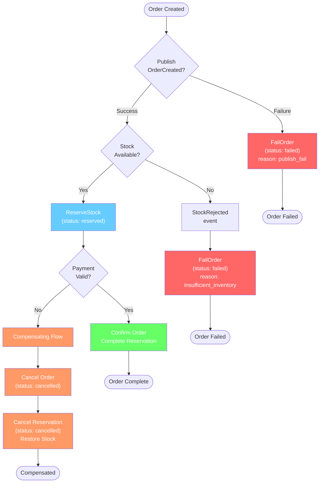

# Compensating Transactions - Failure Recovery

## Compensation Triggers

| Trigger | Compensation Action | Code Location |
|---|---|---|
| Publish `OrderCreated` fails | `FailOrder` (status: failed, reason: publish_fail) | `order/internal/app/command/create_order.go` |
| Insufficient stock | `FailOrder` (status: failed, reason: insufficient_inventory) | `order/internal/app/command/fail_order.go` |
| Payment failed | `CancelReservation` + `RestoreStock` | `inventory/internal/app/command/cancel_reservation.go` |
