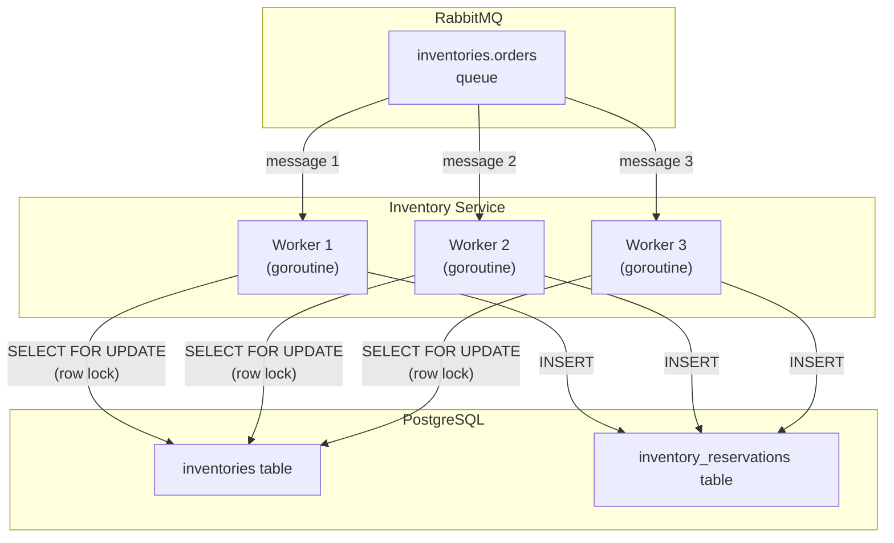

# Competing Consumers - Inventory Workers

## How It Works

1. Three goroutines consume from the same `inventories.orders` queue
2. RabbitMQ delivers each message to exactly one worker (round-robin by default)
3. Each worker opens a database transaction and uses `SELECT FOR UPDATE` to acquire
   row-level locks on the relevant inventory rows
4. If two workers try to reserve the same product, the second one blocks until the
   first commits or rolls back
5. Manual acknowledgment ensures at-least-once delivery semantics
