# CQRS Pattern - Command Query Separation

```mermaid
graph LR
    subgraph Inbound ["Inbound"]
        Req["HTTP Request"]
        Msg["AMQP Message"]
    end

    subgraph Commands ["Command Side (Write)"]
        CO["CreateOrder"]
        RS["ReserveStock"]
        CR["CompleteReservation"]
        CN["CancelReservation"]
        CP["CreatePayment"]
        PP["ProcessPayment"]
        FO["FailOrder"]
        US["UpdateOrderStatus"]
    end

    subgraph Queries ["Query Side (Read)"]
        GO["GetOrder"]
        LO["ListOrders"]
        LI["ListInventories"]
    end

    subgraph WriteModel ["Write Repository"]
        WOrder["orders<br/>order_products"]
        WInv["inventories<br/>inventory_reservations"]
        WPay["payments"]
    end

    subgraph ReadModel ["Read Model"]
        ROrder["OrderView DTO"]
        RInv["InventoryView DTO<br/>(Paginated)"]
    end

    Req --> Commands
    Msg --> Commands
    Req --> Queries

    Commands --> WriteModel
    Queries --> ReadModel

    WriteModel -.->|"same DB,<br/>different interface"| ReadModel
```

## Per-Service CQRS Mapping

| Service | Commands | Queries |
|---|---|---|
| Order | CreateOrder, FailOrder, UpdateOrderStatus | GetOrder, ListOrders |
| Inventory | ReserveStock, CompleteReservation, CancelReservation | ListInventories |
| Payment | CreatePayment, ProcessPayment | None |
