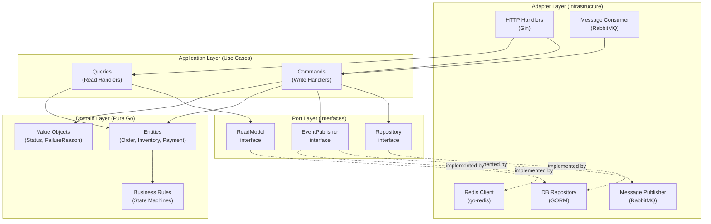

# Hexagonal Architecture - Layer Diagram

```mermaid
graph TB
    subgraph Adapters ["Adapter Layer (Infrastructure)"]
        HTTP["HTTP Handlers<br/>(Gin)"]
        DB["DB Repository<br/>(GORM)"]
        Pub["Message Publisher<br/>(RabbitMQ)"]
        Sub["Message Consumer<br/>(RabbitMQ)"]
        Redis["Redis Client<br/>(go-redis)"]
    end

    subgraph Ports ["Port Layer (Interfaces)"]
        Repo["Repository<br/>interface"]
        RM["ReadModel<br/>interface"]
        EP["EventPublisher<br/>interface"]
    end

    subgraph App ["Application Layer (Use Cases)"]
        Cmd["Commands<br/>(Write Handlers)"]
        Qry["Queries<br/>(Read Handlers)"]
    end

    subgraph Domain ["Domain Layer (Pure Go)"]
        Ent["Entities<br/>(Order, Inventory, Payment)"]
        VO["Value Objects<br/>(Status, FailureReason)"]
        Rules["Business Rules<br/>(State Machines)"]
    end

    HTTP --> Cmd
    HTTP --> Qry
    Sub --> Cmd

    Cmd --> Repo
    Cmd --> EP
    Qry --> RM

    Repo -.->|implemented by| DB
    RM -.->|implemented by| DB
    EP -.->|implemented by| Pub
    EP -.->|implemented by| Redis

    Cmd --> Ent
    Cmd --> VO
    Qry --> Ent
    Ent --> Rules
```
