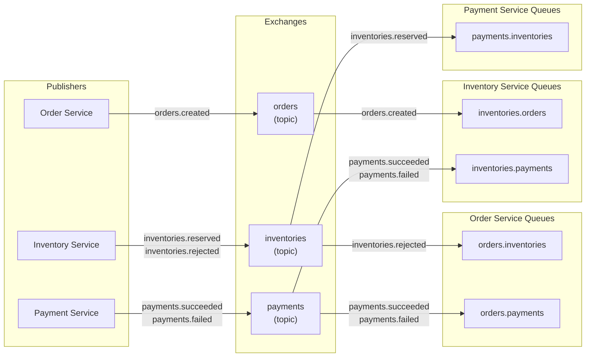

# Message Topology - RabbitMQ Exchanges and Queues

## Exchange Details

| Exchange | Type | DLX | Declared By |
|---|---|---|---|
| `orders` | topic | `orders.dlx` | Order Service publisher |
| `inventories` | topic | `inventories.dlx` | Inventory Service publisher |
| `payments` | topic | `payments.dlx` | Payment Service publisher |

## Queue Bindings

| Queue | Exchange | Routing Key | Consumer |
|---|---|---|---|
| `inventories.orders` | `orders` | `orders.created` | Inventory (3 workers) |
| `orders.inventories` | `inventories` | `inventories.rejected` | Order |
| `orders.payments` | `payments` | `payments.*` | Order |
| `payments.inventories` | `inventories` | `inventories.reserved` | Payment |
| `inventories.payments` | `payments` | `payments.*` | Inventory |
