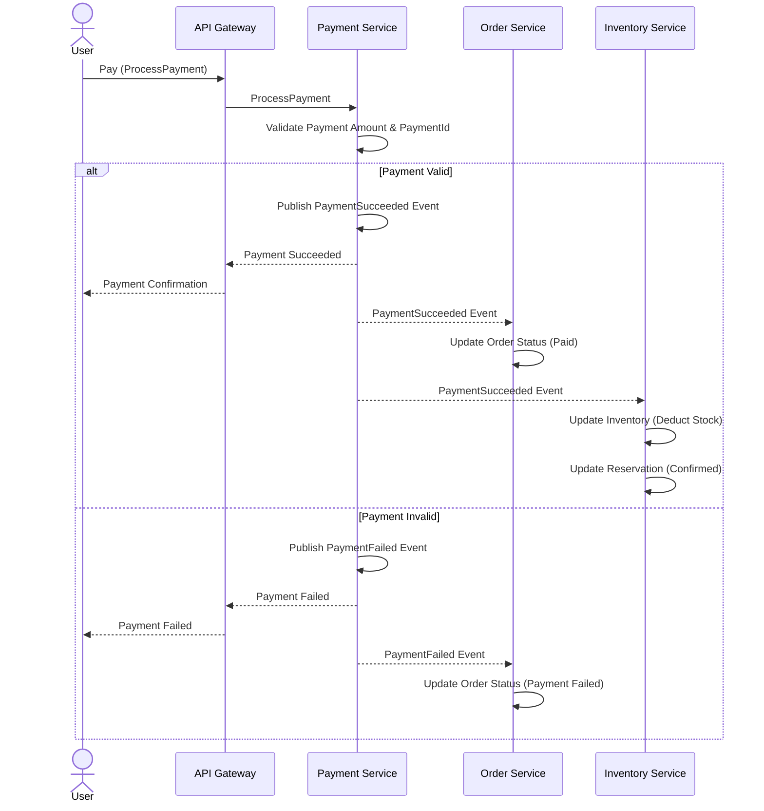

# Process Payment - Sequence Diagram

```mermaid
sequenceDiagram
    actor User
    participant API as API Gateway
    participant Payment as Payment Service
    participant Order as Order Service
    participant Inventory as Inventory Service

    User->>API: Pay (ProcessPayment)
    API->>Payment: ProcessPayment
    Payment->>Payment: Validate Payment Amount & PaymentId

    alt Payment Valid
        Payment->>Payment: Publish PaymentSucceeded Event
        Payment-->>API: Payment Succeeded
        API-->>User: Payment Confirmation

        Payment-->>Order: PaymentSucceeded Event
        Order->>Order: Update Order Status (Paid)

        Payment-->>Inventory: PaymentSucceeded Event
        Inventory->>Inventory: Update Inventory (Deduct Stock)
        Inventory->>Inventory: Update Reservation (Confirmed)
    else Payment Invalid
        Payment->>Payment: Publish PaymentFailed Event
        Payment-->>API: Payment Failed
        API-->>User: Payment Failed

        Payment-->>Order: PaymentFailed Event
        Order->>Order: Update Order Status (Payment Failed)
    end
```
