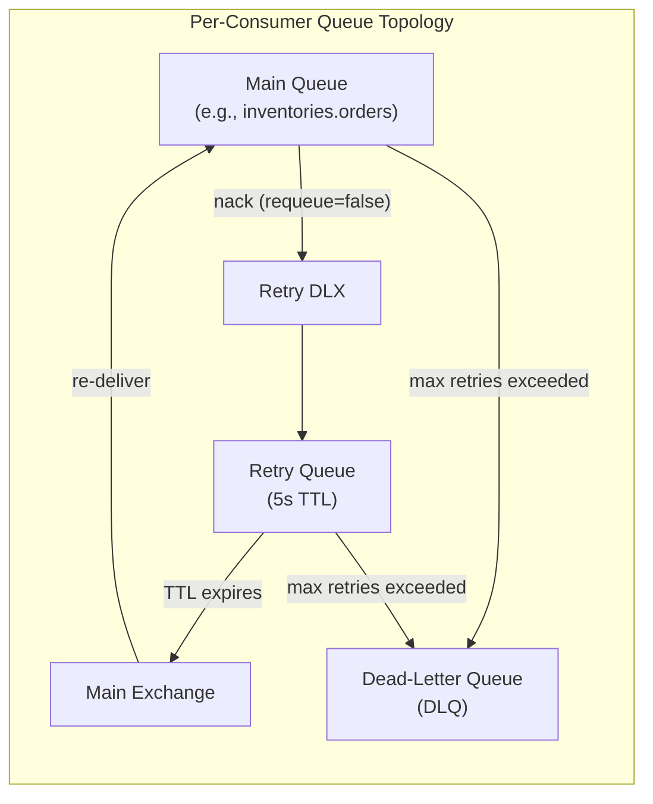

# Retry with Dead-Letter Queue - Error Handling

## Per-Consumer Retry Infrastructure

| Service | Main Queue | Retry Queue | DLQ | Exchange | DLX |
|---|---|---|---|---|---|
| Inventory | `inventories.orders` | `inventories.orders.retry` | `inventories.orders.dlq` | `orders` | `orders.dlx` |
| Inventory | `inventories.payments` | `inventories.payments.retry` | `inventories.payments.dlq` | `payments` | `payments.dlx` |
| Order | `orders.inventories` | `orders.inventories.retry` | `orders.inventories.dlq` | `inventories` | `inventories.dlx` |
| Order | `orders.payments` | `orders.payments.retry` | `orders.payments.dlq` | `payments` | `payments.dlx` |
| Payment | `payments.inventories` | `payments.inventories.retry` | `payments.inventories.dlq` | `inventories` | `inventories.dlx` |

## Retry Behavior

- **Max retries**: 5 (tracked via `x-retry-count` header)
- **Retry TTL**: 5 seconds
- **Ack strategy**: Manual acknowledgment after successful processing
- **DLQ**: Messages that exceed max retries are routed to the dead-letter queue for
  inspection
