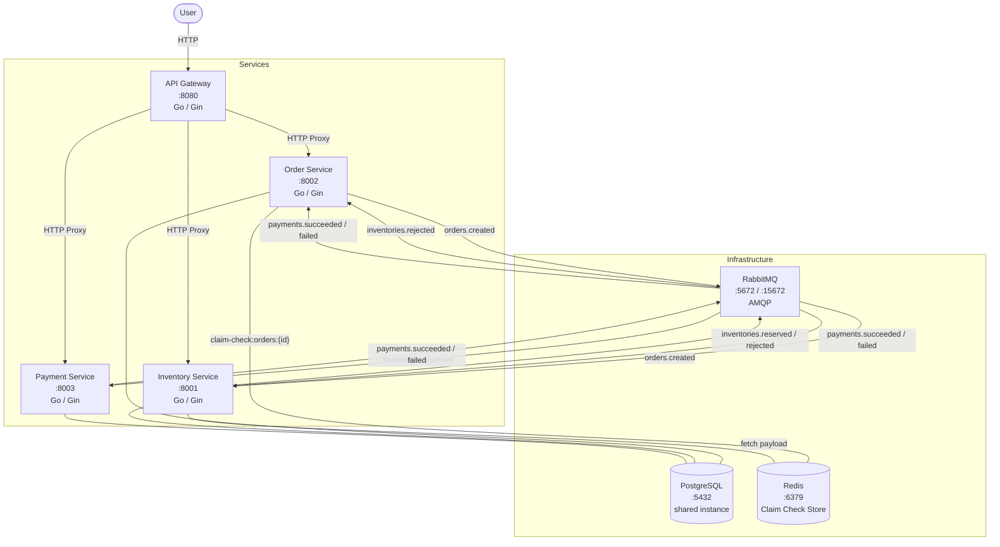

# System Architecture - Component Diagram

```mermaid
graph TB
    User([User])

    subgraph Services
        GW["API Gateway<br/>:8080<br/>Go / Gin"]
        Order["Order Service<br/>:8002<br/>Go / Gin"]
        Inv["Inventory Service<br/>:8001<br/>Go / Gin"]
        Pay["Payment Service<br/>:8003<br/>Go / Gin"]
    end

    subgraph Infrastructure
        PG[("PostgreSQL<br/>:5432<br/>shared instance")]
        RMQ["RabbitMQ<br/>:5672 / :15672<br/>AMQP"]
        Redis[("Redis<br/>:6379<br/>Claim Check Store")]
    end

    User -->|HTTP| GW
    GW -->|HTTP Proxy| Order
    GW -->|HTTP Proxy| Inv
    GW -->|HTTP Proxy| Pay

    Order -->|orders.created| RMQ
    RMQ -->|orders.created| Inv
    Inv -->|inventories.reserved / rejected| RMQ
    RMQ -->|inventories.reserved| Pay
    RMQ -->|inventories.rejected| Order
    Pay -->|payments.succeeded / failed| RMQ
    RMQ -->|payments.succeeded / failed| Order
    RMQ -->|payments.succeeded / failed| Inv

    Order --- PG
    Inv --- PG
    Pay --- PG

    Order ---|"claim-check:orders:{id}"| Redis
    Inv ---|"fetch payload"| Redis
```
