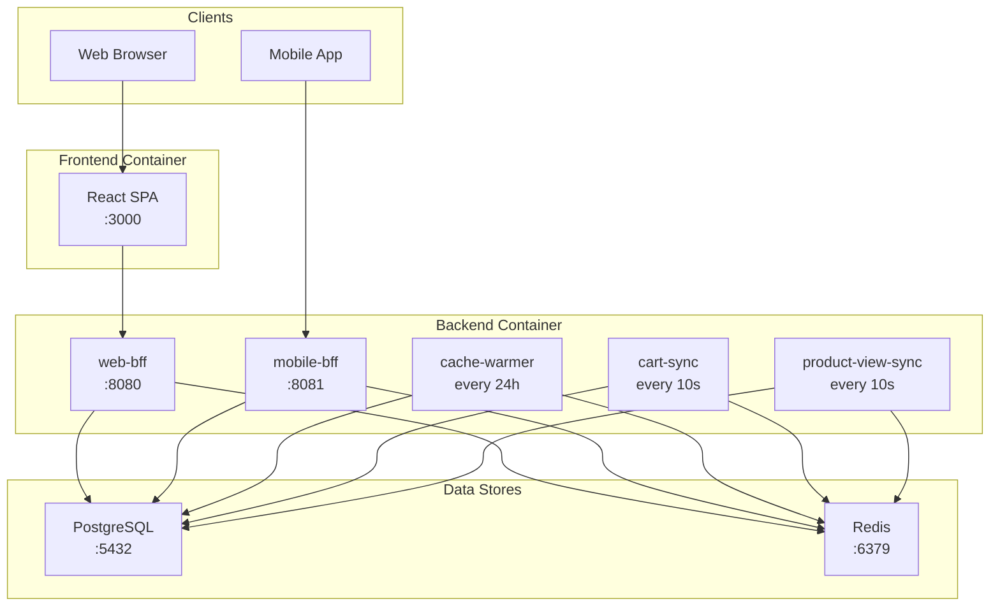

# High-Level Architecture

The system runs in three Docker containers backed by a shared PostgreSQL
database and Redis cache.

## Container Breakdown

| Container | Processes | Purpose |
|---|---|---|
| Backend | 5 | Two BFF servers + three background workers |
| Frontend | 1 | React application served to browsers |
| Cache | 1 | Redis instance for caching |

The backend container demonstrates **Compute Resource Consolidation** -- all
five processes share one container because each background worker is too
lightweight to justify its own container.
