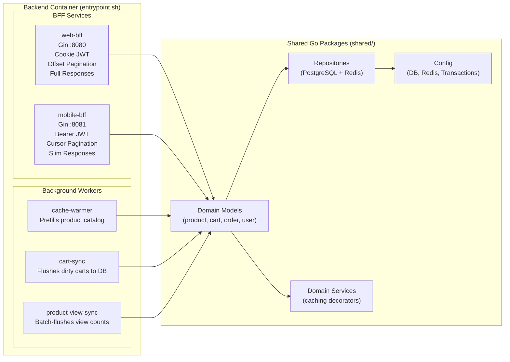

# Services Overview

## BFF Comparison

| Aspect | web-bff | mobile-bff |
|---|---|---|
| Port | 8080 | 8081 |
| Auth | HTTP-only cookies | Bearer token header |
| Product list | Full `Product` objects | `ProductSummary` (id, name, price) |
| Cart pagination | Offset (`page`, `page_size`) | Cursor (`cursor`, `page_size`) |
| Cart response | Raw `CartItem` | Enriched with `product_name`, `price` |
| Order response | Full `Order` | Slim `OrderResponse` |
| Cart caching | Write-Behind (Redis + async DB) | Direct DB |
| Profile caching | Cache-Aside (DB write + cache invalidate) | Direct DB |
