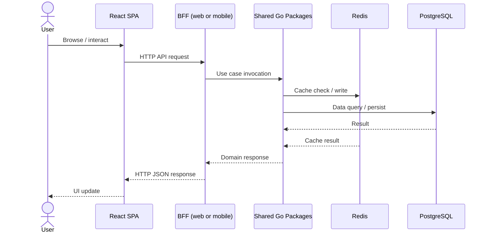

# Application Flow

Generic request lifecycle showing how a client request flows through the
system layers.

```mermaid
sequenceDiagram
    actor User
    participant Frontend as React SPA
    participant BFF as BFF (web or mobile)
    participant Shared as Shared Go Packages
    participant Redis
    participant DB as PostgreSQL

    User->>Frontend: Browse / interact
    Frontend->>BFF: HTTP API request
    BFF->>Shared: Use case invocation
    Shared->>Redis: Cache check / write
    Shared->>DB: Data query / persist
    DB-->>Shared: Result
    Redis-->>Shared: Cache result
    Shared-->>BFF: Domain response
    BFF-->>Frontend: HTTP JSON response
    Frontend-->>User: UI update
```
