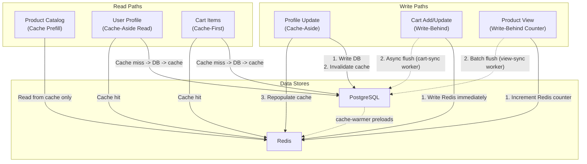

# Data Flow Diagram

Shows all write and read paths through the system, including the three
caching strategies and their async flush routes.

```mermaid
graph TB
    subgraph "Write Paths"
        W1["Profile Update<br/>(Cache-Aside)"]
        W2["Cart Add/Update<br/>(Write-Behind)"]
        W3["Product View<br/>(Write-Behind Counter)"]
    end

    subgraph "Read Paths"
        R1["Product Catalog<br/>(Cache Prefill)"]
        R2["User Profile<br/>(Cache-Aside Read)"]
        R3["Cart Items<br/>(Cache-First)"]
    end

    subgraph "Data Stores"
        PG["PostgreSQL"]
        RD["Redis"]
    end

    W1 -->|"1. Write DB<br/>2. Invalidate cache"| PG
    W1 -->|"3. Repopulate cache"| RD

    W2 -->|"1. Write Redis immediately"| RD
    W2 -.->|"2. Async flush (cart-sync worker)"| PG

    W3 -->|"1. Increment Redis counter"| RD
    W3 -.->|"2. Batch flush (view-sync worker)"| PG

    R1 -->|"Read from cache only"| RD
    R2 -->|"Cache miss -> DB -> cache"| PG
    R2 -->|"Cache hit"| RD
    R3 -->|"Cache miss -> DB -> cache"| PG
    R3 -->|"Cache hit"| RD

    PG -.->|"cache-warmer preloads"| RD
```
