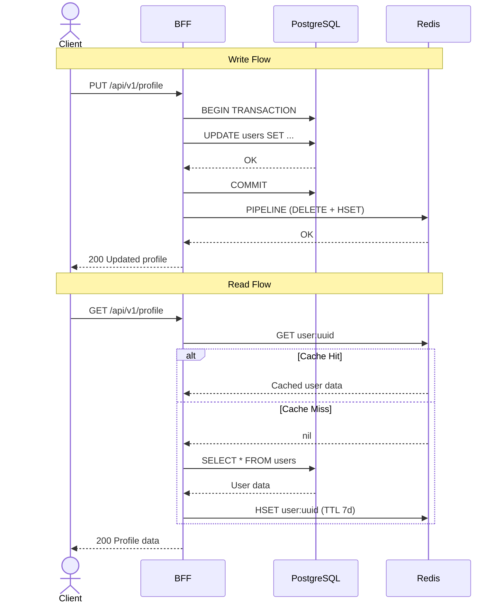
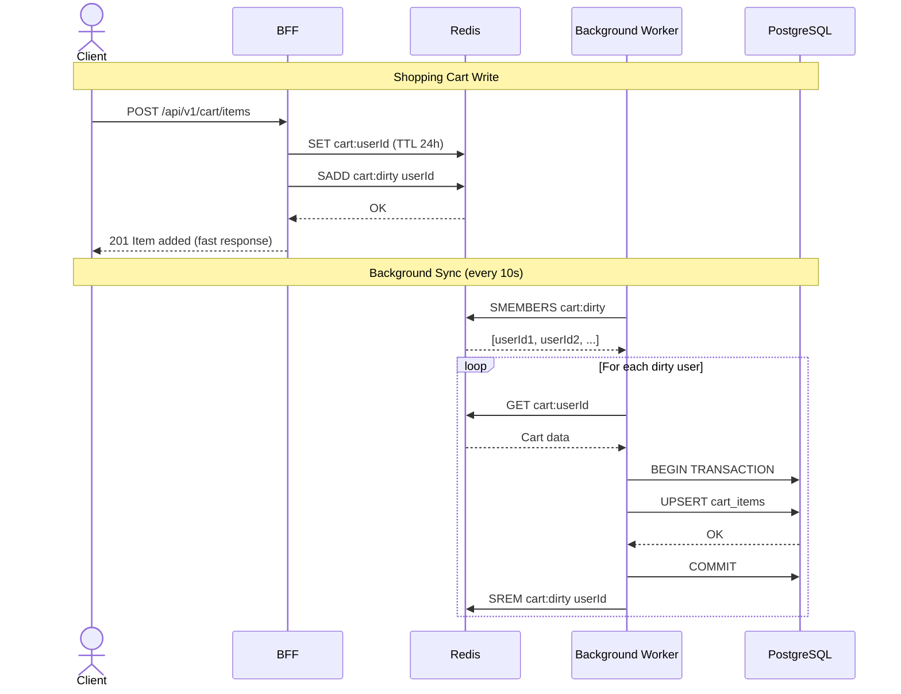
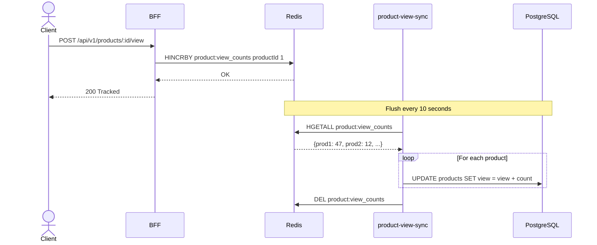
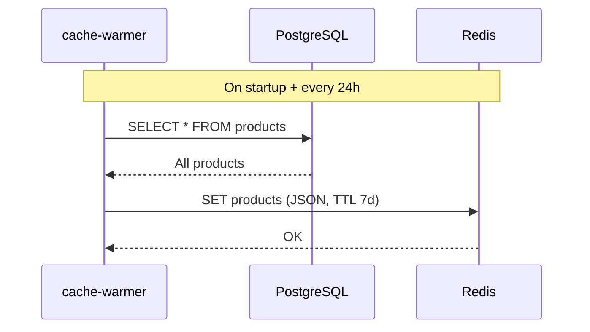

# Caching Strategies Detail

## Strategy 1 -- Cache-Aside: Write DB First, Then Invalidate Cache

Applied to **User Profile** updates. Data integrity is critical -- changes must
be persisted to the database before the cache is updated.

**Redis keys:** `user:<uuid>` (hash), TTL 7 days

---

## Strategy 2 -- Write-Behind: Write Cache First, Async DB

Applied to **Shopping Cart**. The cache is the source of truth during active
sessions, and the `cart-sync` worker persists to the database asynchronously.

**Redis keys:**

- `cart:<userId>` (JSON), TTL 24h
- `cart:dirty` (set of user IDs with pending changes)

---

## Strategy 2b -- Product View Counter (Batch Flush)

**Redis keys:** `product:view_counts` (hash of productId to count)

---

## Strategy 3 -- Cache-Aside with Prefill: Read Only from Cache

Applied to **Product Catalog**. The `cache-warmer` worker preloads all products
into Redis on startup and every 24 hours.

**Redis keys:** `products` (JSON-encoded slice), TTL 7 days
