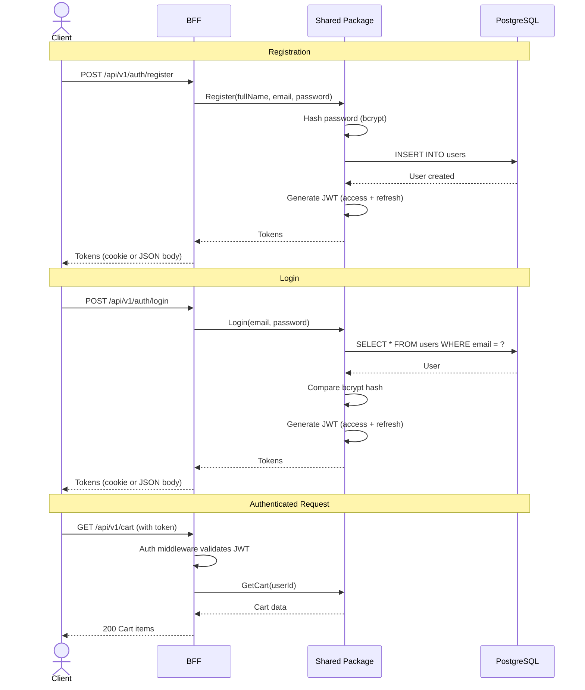

# Authentication Flow

```mermaid
sequenceDiagram
    actor Client
    participant BFF
    participant Shared as Shared Package
    participant DB as PostgreSQL

    Note over Client, DB: Registration

    Client->>BFF: POST /api/v1/auth/register
    BFF->>Shared: Register(fullName, email, password)
    Shared->>Shared: Hash password (bcrypt)
    Shared->>DB: INSERT INTO users
    DB-->>Shared: User created
    Shared->>Shared: Generate JWT (access + refresh)
    Shared-->>BFF: Tokens
    BFF-->>Client: Tokens (cookie or JSON body)

    Note over Client, DB: Login

    Client->>BFF: POST /api/v1/auth/login
    BFF->>Shared: Login(email, password)
    Shared->>DB: SELECT * FROM users WHERE email = ?
    DB-->>Shared: User
    Shared->>Shared: Compare bcrypt hash
    Shared->>Shared: Generate JWT (access + refresh)
    Shared-->>BFF: Tokens
    BFF-->>Client: Tokens (cookie or JSON body)

    Note over Client, DB: Authenticated Request

    Client->>BFF: GET /api/v1/cart (with token)
    BFF->>BFF: Auth middleware validates JWT
    BFF->>Shared: GetCart(userId)
    Shared-->>BFF: Cart data
    BFF-->>Client: 200 Cart items
```
