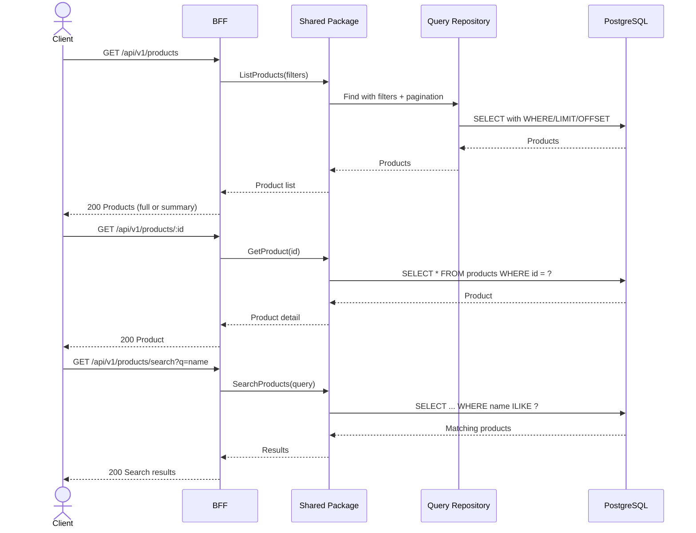

# Product Catalog Flow

```mermaid
sequenceDiagram
    actor Client
    participant BFF
    participant Shared as Shared Package
    participant QueryRepo as Query Repository
    participant DB as PostgreSQL

    Client->>BFF: GET /api/v1/products
    BFF->>Shared: ListProducts(filters)
    Shared->>QueryRepo: Find with filters + pagination
    QueryRepo->>DB: SELECT with WHERE/LIMIT/OFFSET
    DB-->>QueryRepo: Products
    QueryRepo-->>Shared: Products
    Shared-->>BFF: Product list
    BFF-->>Client: 200 Products (full or summary)

    Client->>BFF: GET /api/v1/products/:id
    BFF->>Shared: GetProduct(id)
    Shared->>DB: SELECT * FROM products WHERE id = ?
    DB-->>Shared: Product
    Shared-->>BFF: Product detail
    BFF-->>Client: 200 Product

    Client->>BFF: GET /api/v1/products/search?q=name
    BFF->>Shared: SearchProducts(query)
    Shared->>DB: SELECT ... WHERE name ILIKE ?
    DB-->>Shared: Matching products
    Shared-->>BFF: Results
    BFF-->>Client: 200 Search results
```
