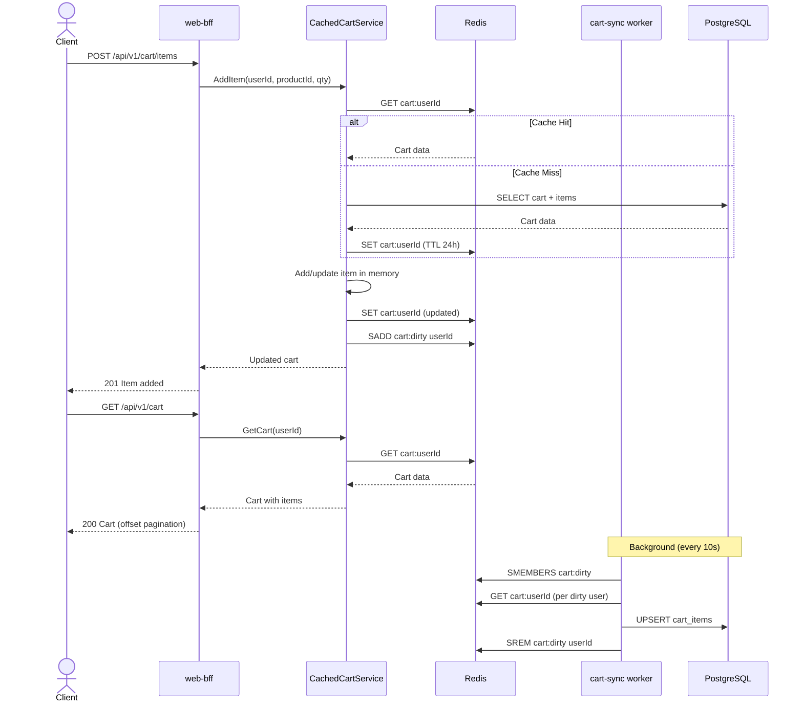
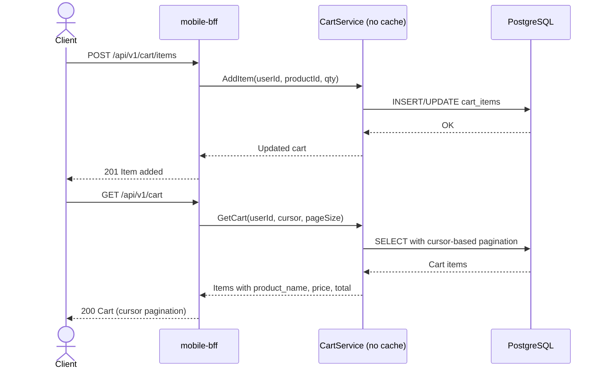

# Shopping Cart Flow

## Web BFF -- Cached (Write-Behind)

```mermaid
sequenceDiagram
    actor Client
    participant BFF as web-bff
    participant Cached as CachedCartService
    participant Cache as Redis
    participant Worker as cart-sync worker
    participant DB as PostgreSQL

    Client->>BFF: POST /api/v1/cart/items
    BFF->>Cached: AddItem(userId, productId, qty)
    Cached->>Cache: GET cart:userId
    alt Cache Hit
        Cache-->>Cached: Cart data
    else Cache Miss
        Cached->>DB: SELECT cart + items
        DB-->>Cached: Cart data
        Cached->>Cache: SET cart:userId (TTL 24h)
    end
    Cached->>Cached: Add/update item in memory
    Cached->>Cache: SET cart:userId (updated)
    Cached->>Cache: SADD cart:dirty userId
    Cached-->>BFF: Updated cart
    BFF-->>Client: 201 Item added

    Client->>BFF: GET /api/v1/cart
    BFF->>Cached: GetCart(userId)
    Cached->>Cache: GET cart:userId
    Cache-->>Cached: Cart data
    Cached-->>BFF: Cart with items
    BFF-->>Client: 200 Cart (offset pagination)

    Note over Worker, DB: Background (every 10s)
    Worker->>Cache: SMEMBERS cart:dirty
    Worker->>Cache: GET cart:userId (per dirty user)
    Worker->>DB: UPSERT cart_items
    Worker->>Cache: SREM cart:dirty userId
```

---

## Mobile BFF -- Direct DB (No Cache)

```mermaid
sequenceDiagram
    actor Client
    participant BFF as mobile-bff
    participant Svc as CartService (no cache)
    participant DB as PostgreSQL

    Client->>BFF: POST /api/v1/cart/items
    BFF->>Svc: AddItem(userId, productId, qty)
    Svc->>DB: INSERT/UPDATE cart_items
    DB-->>Svc: OK
    Svc-->>BFF: Updated cart
    BFF-->>Client: 201 Item added

    Client->>BFF: GET /api/v1/cart
    BFF->>Svc: GetCart(userId, cursor, pageSize)
    Svc->>DB: SELECT with cursor-based pagination
    DB-->>Svc: Cart items
    Svc-->>BFF: Items with product_name, price, total
    BFF-->>Client: 200 Cart (cursor pagination)
```
