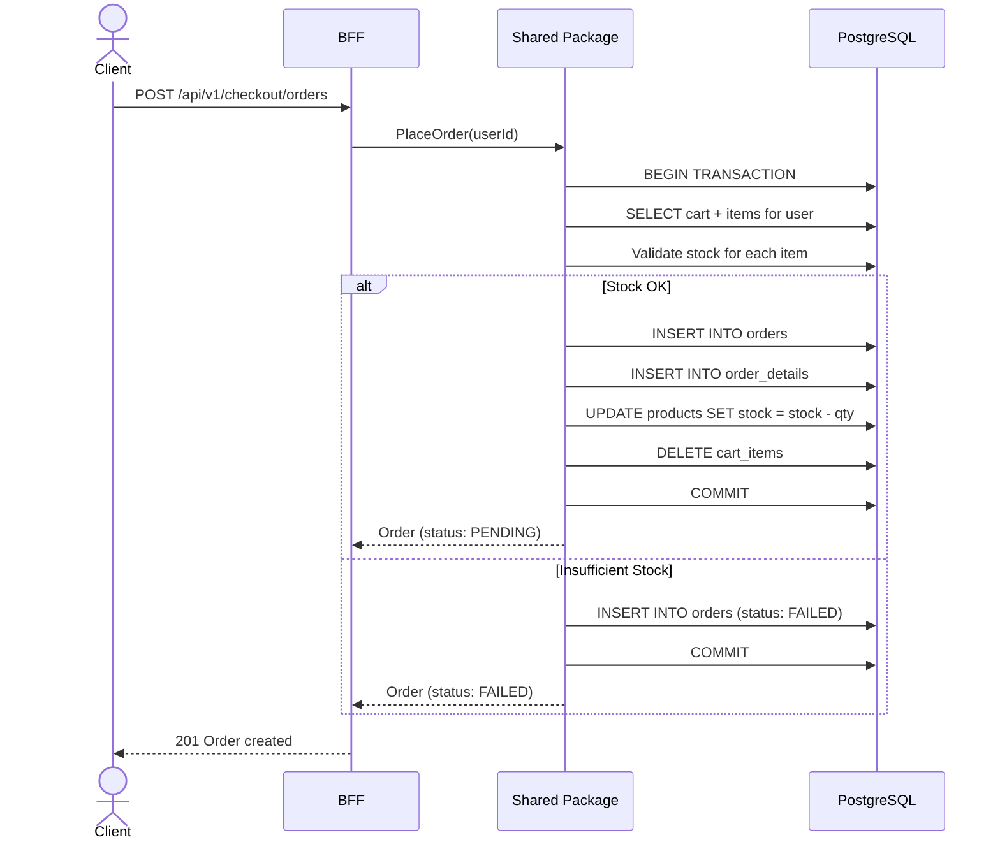

# Checkout Flow

```mermaid
sequenceDiagram
    actor Client
    participant BFF
    participant Shared as Shared Package
    participant DB as PostgreSQL

    Client->>BFF: POST /api/v1/checkout/orders
    BFF->>Shared: PlaceOrder(userId)
    Shared->>DB: BEGIN TRANSACTION
    Shared->>DB: SELECT cart + items for user
    Shared->>DB: Validate stock for each item
    alt Stock OK
        Shared->>DB: INSERT INTO orders
        Shared->>DB: INSERT INTO order_details
        Shared->>DB: UPDATE products SET stock = stock - qty
        Shared->>DB: DELETE cart_items
        Shared->>DB: COMMIT
        Shared-->>BFF: Order (status: PENDING)
    else Insufficient Stock
        Shared->>DB: INSERT INTO orders (status: FAILED)
        Shared->>DB: COMMIT
        Shared-->>BFF: Order (status: FAILED)
    end
    BFF-->>Client: 201 Order created
```
