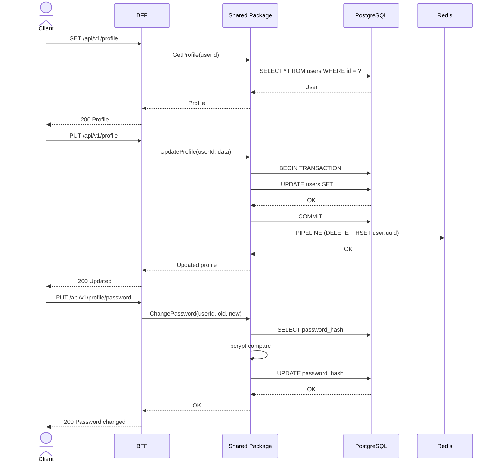

# Profile Flow

```mermaid
sequenceDiagram
    actor Client
    participant BFF
    participant Shared as Shared Package
    participant DB as PostgreSQL
    participant Cache as Redis

    Client->>BFF: GET /api/v1/profile
    BFF->>Shared: GetProfile(userId)
    Shared->>DB: SELECT * FROM users WHERE id = ?
    DB-->>Shared: User
    Shared-->>BFF: Profile
    BFF-->>Client: 200 Profile

    Client->>BFF: PUT /api/v1/profile
    BFF->>Shared: UpdateProfile(userId, data)
    Shared->>DB: BEGIN TRANSACTION
    Shared->>DB: UPDATE users SET ...
    DB-->>Shared: OK
    Shared->>DB: COMMIT
    Shared->>Cache: PIPELINE (DELETE + HSET user:uuid)
    Cache-->>Shared: OK
    Shared-->>BFF: Updated profile
    BFF-->>Client: 200 Updated

    Client->>BFF: PUT /api/v1/profile/password
    BFF->>Shared: ChangePassword(userId, old, new)
    Shared->>DB: SELECT password_hash
    Shared->>Shared: bcrypt compare
    Shared->>DB: UPDATE password_hash
    DB-->>Shared: OK
    Shared-->>BFF: OK
    BFF-->>Client: 200 Password changed
```
