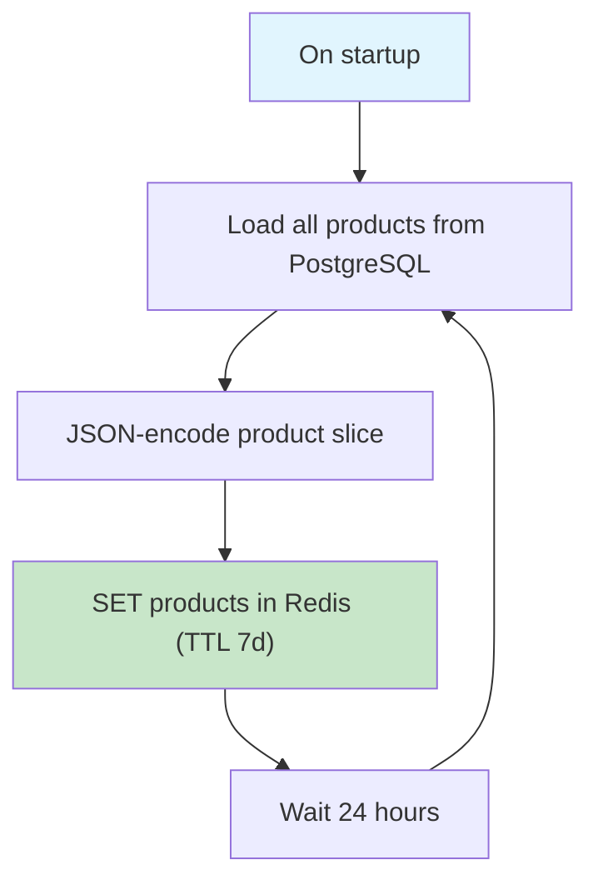
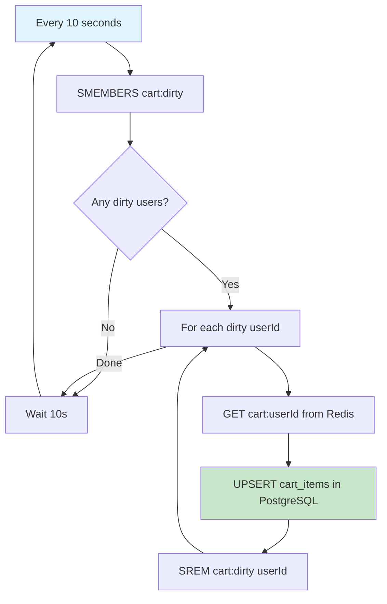
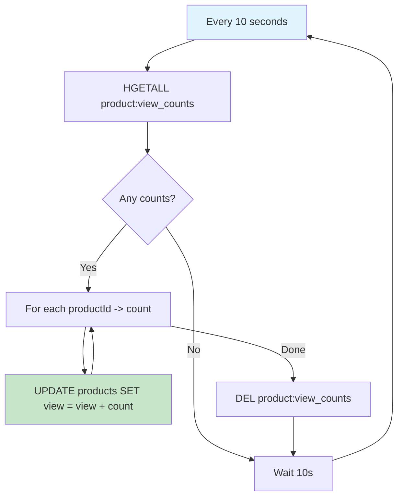

# Worker Detail Flows

## cache-warmer

```mermaid
flowchart TD
    Start["On startup"] --> Load["Load all products from PostgreSQL"]
    Load --> Encode["JSON-encode product slice"]
    Encode --> Set["SET products in Redis (TTL 7d)"]
    Set --> Wait["Wait 24 hours"]
    Wait --> Load

    style Start fill:#e1f5fe
    style Set fill:#c8e6c9
```

---

## cart-sync

```mermaid
flowchart TD
    Tick["Every 10 seconds"] --> Dirty["SMEMBERS cart:dirty"]
    Dirty --> HasDirty{"Any dirty users?"}
    HasDirty -->|"No"| Wait["Wait 10s"]
    Wait --> Tick
    HasDirty -->|"Yes"| Loop["For each dirty userId"]
    Loop --> GetCart["GET cart:userId from Redis"]
    GetCart --> Upsert["UPSERT cart_items in PostgreSQL"]
    Upsert --> Remove["SREM cart:dirty userId"]
    Remove --> Loop
    Loop -->|"Done"| Wait

    style Tick fill:#e1f5fe
    style Upsert fill:#c8e6c9
```

---

## product-view-sync

```mermaid
flowchart TD
    Tick["Every 10 seconds"] --> GetAll["HGETALL product:view_counts"]
    GetAll --> HasCounts{"Any counts?"}
    HasCounts -->|"No"| Wait["Wait 10s"]
    Wait --> Tick
    HasCounts -->|"Yes"| Loop["For each productId -> count"]
    Loop --> Update["UPDATE products SET view = view + count"]
    Update --> Loop
    Loop -->|"Done"| Delete["DEL product:view_counts"]
    Delete --> Wait

    style Tick fill:#e1f5fe
    style Update fill:#c8e6c9
```
