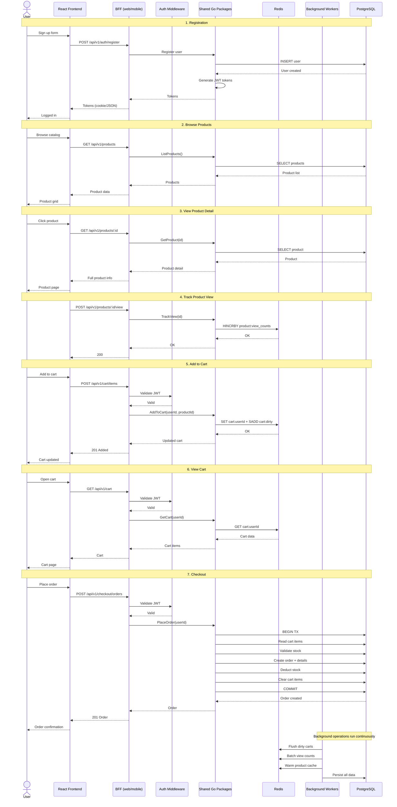

# End-to-End Flow

A complete user journey from registration to placing an order:

```mermaid
sequenceDiagram
    actor User
    participant FE as React Frontend
    participant BFF as BFF (web/mobile)
    participant Auth as Auth Middleware
    participant Shared as Shared Go Packages
    participant Redis
    participant Workers as Background Workers
    participant DB as PostgreSQL

    Note over User, DB: 1. Registration
    User->>FE: Sign up form
    FE->>BFF: POST /api/v1/auth/register
    BFF->>Shared: Register user
    Shared->>DB: INSERT user
    DB-->>Shared: User created
    Shared->>Shared: Generate JWT tokens
    Shared-->>BFF: Tokens
    BFF-->>FE: Tokens (cookie/JSON)
    FE-->>User: Logged in

    Note over User, DB: 2. Browse Products
    User->>FE: Browse catalog
    FE->>BFF: GET /api/v1/products
    BFF->>Shared: ListProducts()
    Shared->>DB: SELECT products
    DB-->>Shared: Product list
    Shared-->>BFF: Products
    BFF-->>FE: Product data
    FE-->>User: Product grid

    Note over User, DB: 3. View Product Detail
    User->>FE: Click product
    FE->>BFF: GET /api/v1/products/:id
    BFF->>Shared: GetProduct(id)
    Shared->>DB: SELECT product
    DB-->>Shared: Product
    Shared-->>BFF: Product detail
    BFF-->>FE: Full product info
    FE-->>User: Product page

    Note over User, DB: 4. Track Product View
    FE->>BFF: POST /api/v1/products/:id/view
    BFF->>Shared: TrackView(id)
    Shared->>Redis: HINCRBY product:view_counts
    Redis-->>Shared: OK
    Shared-->>BFF: OK
    BFF-->>FE: 200

    Note over User, DB: 5. Add to Cart
    User->>FE: Add to cart
    FE->>BFF: POST /api/v1/cart/items
    BFF->>Auth: Validate JWT
    Auth-->>BFF: Valid
    BFF->>Shared: AddToCart(userId, productId)
    Shared->>Redis: SET cart:userId + SADD cart:dirty
    Redis-->>Shared: OK
    Shared-->>BFF: Updated cart
    BFF-->>FE: 201 Added
    FE-->>User: Cart updated

    Note over User, DB: 6. View Cart
    User->>FE: Open cart
    FE->>BFF: GET /api/v1/cart
    BFF->>Auth: Validate JWT
    Auth-->>BFF: Valid
    BFF->>Shared: GetCart(userId)
    Shared->>Redis: GET cart:userId
    Redis-->>Shared: Cart data
    Shared-->>BFF: Cart items
    BFF-->>FE: Cart
    FE-->>User: Cart page

    Note over User, DB: 7. Checkout
    User->>FE: Place order
    FE->>BFF: POST /api/v1/checkout/orders
    BFF->>Auth: Validate JWT
    Auth-->>BFF: Valid
    BFF->>Shared: PlaceOrder(userId)
    Shared->>DB: BEGIN TX
    Shared->>DB: Read cart items
    Shared->>DB: Validate stock
    Shared->>DB: Create order + details
    Shared->>DB: Deduct stock
    Shared->>DB: Clear cart items
    Shared->>DB: COMMIT
    DB-->>Shared: Order created
    Shared-->>BFF: Order
    BFF-->>FE: 201 Order
    FE-->>User: Order confirmation

    Note over Workers, DB: Background operations run continuously
    Workers->>Redis: Flush dirty carts
    Workers->>Redis: Batch view counts
    Workers->>Redis: Warm product cache
    Workers->>DB: Persist all data
```
