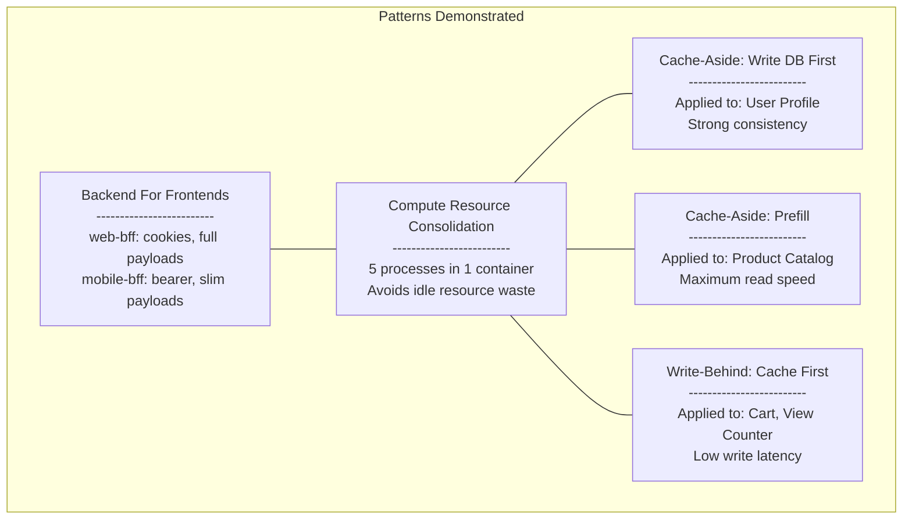
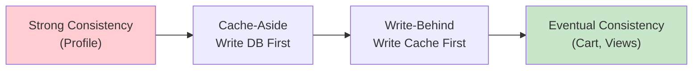

# Architecture Patterns Summary

## Trade-offs

| Strategy | Latency | Freshness | Complexity | Use When |
|---|---|---|---|---|
| Cache-Aside (write DB first) | Higher writes | Immediate | Medium | Data integrity matters |
| Write-Behind (cache first) | Lowest writes | Eventual | High | Frequent writes, ok with delay |
| Cache-Aside (prefill) | Lowest reads | Periodic | Low | Read-heavy, infrequent changes |

## Consistency Spectrum

