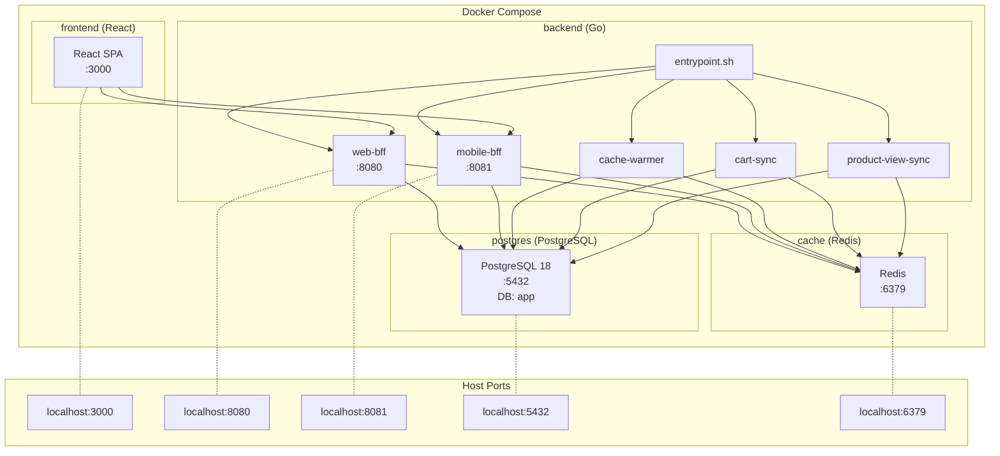
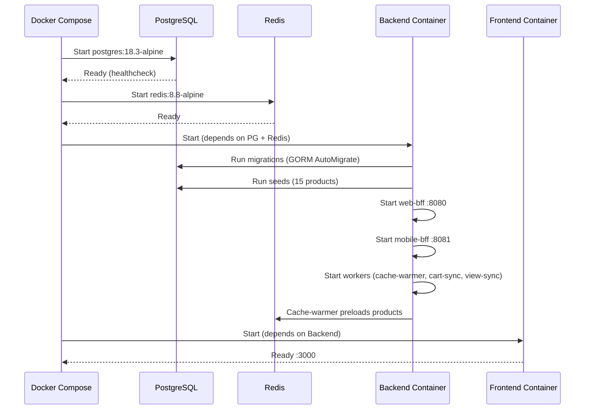

# Deployment Diagram

Shows how Docker Compose orchestrates the containers, ports, and shared
networks.

```mermaid
graph TB
    subgraph "Docker Compose"
        subgraph "backend (Go)"
            Entrypoint["entrypoint.sh"]
            Entrypoint --> WB["web-bff<br/>:8080"]
            Entrypoint --> MB["mobile-bff<br/>:8081"]
            Entrypoint --> CW["cache-warmer"]
            Entrypoint --> CS["cart-sync"]
            Entrypoint --> VS["product-view-sync"]
        end

        subgraph "frontend (React)"
            React["React SPA<br/>:3000"]
        end

        subgraph "cache (Redis)"
            Redis["Redis<br/>:6379"]
        end

        subgraph "postgres (PostgreSQL)"
            PG["PostgreSQL 18<br/>:5432<br/>DB: app"]
        end
    end

    WB --> PG
    WB --> Redis
    MB --> PG
    MB --> Redis
    CW --> PG
    CW --> Redis
    CS --> PG
    CS --> Redis
    VS --> PG
    VS --> Redis
    React --> WB
    React --> MB

    subgraph "Host Ports"
        P3000["localhost:3000"]
        P8080["localhost:8080"]
        P8081["localhost:8081"]
        P5432["localhost:5432"]
        P6379["localhost:6379"]
    end

    React -.- P3000
    WB -.- P8080
    MB -.- P8081
    PG -.- P5432
    Redis -.- P6379
```

## Container Lifecycle

```mermaid
sequenceDiagram
    participant Compose as Docker Compose
    participant PG as PostgreSQL
    participant Redis as Redis
    participant Backend as Backend Container
    participant FE as Frontend Container

    Compose->>PG: Start postgres:18.3-alpine
    PG-->>Compose: Ready (healthcheck)
    Compose->>Redis: Start redis:8.8-alpine
    Redis-->>Compose: Ready
    Compose->>Backend: Start (depends on PG + Redis)
    Backend->>PG: Run migrations (GORM AutoMigrate)
    Backend->>PG: Run seeds (15 products)
    Backend->>Backend: Start web-bff :8080
    Backend->>Backend: Start mobile-bff :8081
    Backend->>Backend: Start workers (cache-warmer, cart-sync, view-sync)
    Backend->>Redis: Cache-warmer preloads products
    Compose->>FE: Start (depends on Backend)
    FE-->>Compose: Ready :3000
```
