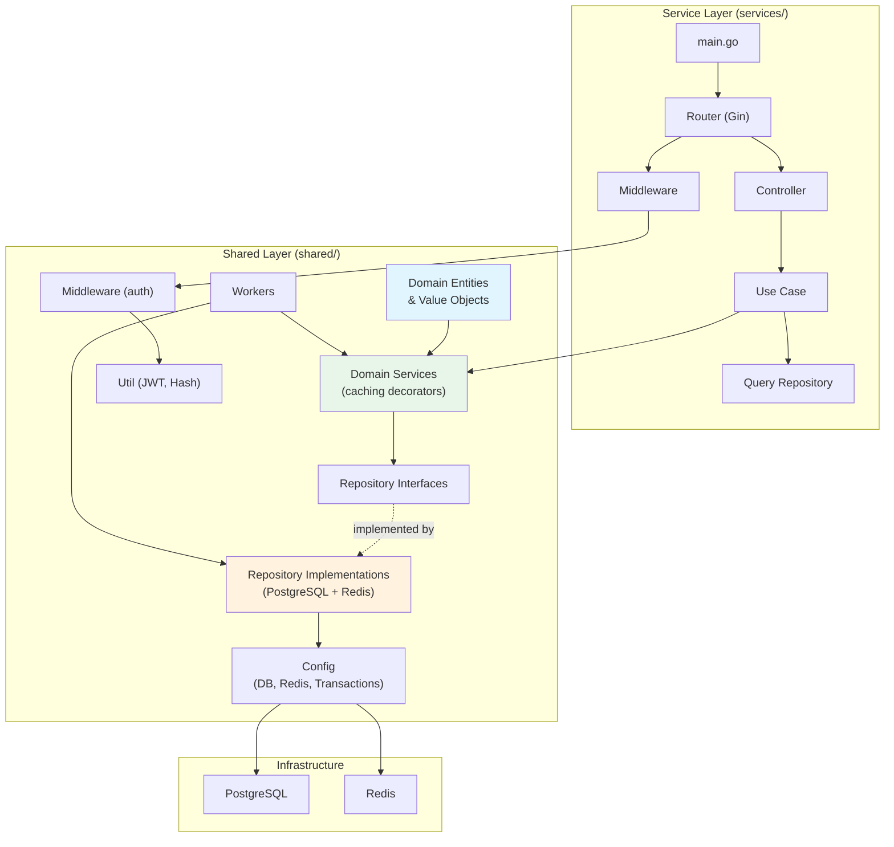
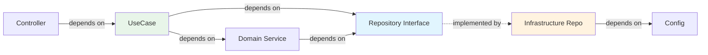

# Code Architecture Layers

Shows the Clean Architecture / DDD layering within the codebase and how
dependencies flow inward.

## Dependency Rule

Dependencies point inward. The domain layer has zero external dependencies.
Controllers and infrastructure depend on domain abstractions, never the
other way around.
