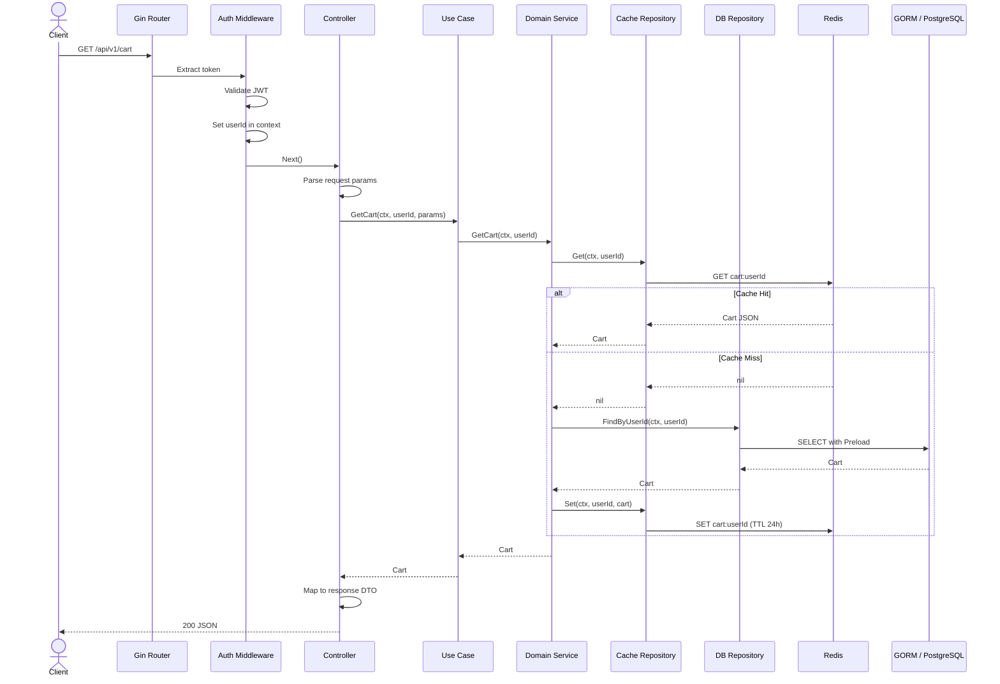

# Request Lifecycle

Traces a single authenticated HTTP request through every layer of the system.

```mermaid
sequenceDiagram
    actor Client
    participant Gin as Gin Router
    participant MW as Auth Middleware
    participant Ctrl as Controller
    participant UC as Use Case
    participant DSvc as Domain Service
    participant CacheRepo as Cache Repository
    participant DBRepo as DB Repository
    participant Redis
    participant GORM as GORM / PostgreSQL

    Client->>Gin: GET /api/v1/cart
    Gin->>MW: Extract token
    MW->>MW: Validate JWT
    MW->>MW: Set userId in context
    MW->>Ctrl: Next()

    Ctrl->>Ctrl: Parse request params
    Ctrl->>UC: GetCart(ctx, userId, params)

    UC->>DSvc: GetCart(ctx, userId)
    DSvc->>CacheRepo: Get(ctx, userId)
    CacheRepo->>Redis: GET cart:userId

    alt Cache Hit
        Redis-->>CacheRepo: Cart JSON
        CacheRepo-->>DSvc: Cart
    else Cache Miss
        Redis-->>CacheRepo: nil
        CacheRepo-->>DSvc: nil
        DSvc->>DBRepo: FindByUserId(ctx, userId)
        DBRepo->>GORM: SELECT with Preload
        GORM-->>DBRepo: Cart
        DBRepo-->>DSvc: Cart
        DSvc->>CacheRepo: Set(ctx, userId, cart)
        CacheRepo->>Redis: SET cart:userId (TTL 24h)
    end

    DSvc-->>UC: Cart
    UC-->>Ctrl: Cart
    Ctrl->>Ctrl: Map to response DTO
    Ctrl-->>Client: 200 JSON
```
