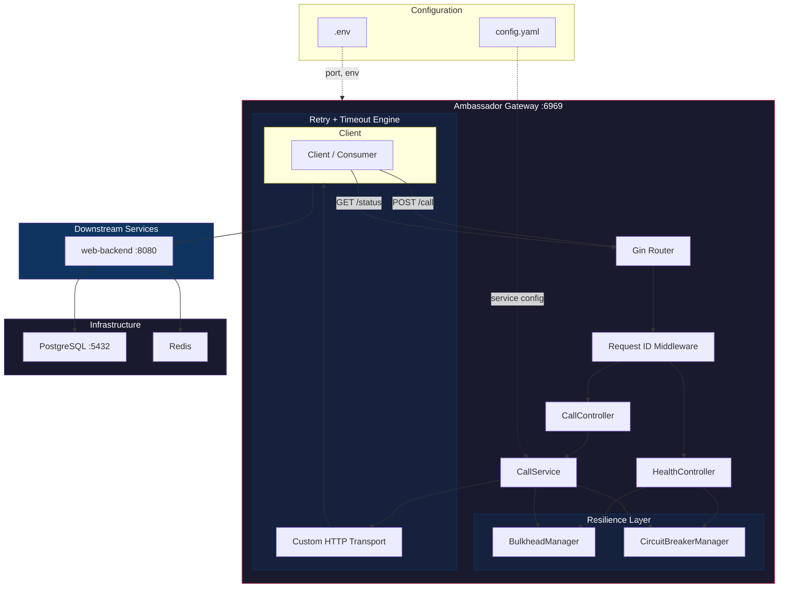
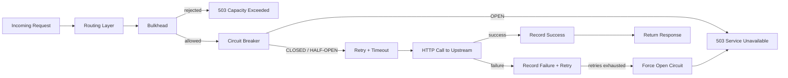

# High-Level Architecture Diagram

```mermaid
graph TB
    subgraph Client
        Caller["Client / Consumer"]
    end

    subgraph Gateway["Ambassador Gateway :6969"]
        MW["Request ID Middleware"]
        Router["Gin Router"]
        CallCtrl["CallController"]
        HealthCtrl["HealthController"]
        CallSvc["CallService"]

        subgraph Resilience["Resilience Layer"]
            BH["BulkheadManager"]
            CB["CircuitBreakerManager"]
        end

        subgraph RetryEngine["Retry + Timeout Engine"]
            Transport["Custom HTTP Transport"]
            Client["HTTP Client"]
        end
    end

    subgraph Config["Configuration"]
        YAML["config.yaml"]
        ENV[".env"]
    end

    subgraph Downstream["Downstream Services"]
        WebBackend["web-backend :8080"]
    end

    subgraph Infra["Infrastructure"]
        Postgres["PostgreSQL :5432"]
        Redis["Redis"]
    end

    Caller -->|POST /call| Router
    Caller -->|GET /status| Router
    Router --> MW
    MW --> CallCtrl
    MW --> HealthCtrl
    CallCtrl --> CallSvc
    HealthCtrl --> CB
    HealthCtrl --> BH

    CallSvc --> BH
    CallSvc --> CB
    CallSvc --> Transport
    Transport --> Client
    Client --> WebBackend

    WebBackend --> Postgres
    WebBackend --> Redis

    YAML -.->|service config| CallSvc
    ENV -.->|port, env| Gateway

    style Gateway fill:#1a1a2e,stroke:#e94560,color:#fff
    style Resilience fill:#16213e,stroke:#0f3460,color:#fff
    style RetryEngine fill:#16213e,stroke:#0f3460,color:#fff
    style Downstream fill:#0f3460,stroke:#533483,color:#fff
    style Infra fill:#1a1a2e,stroke:#533483,color:#fff
```

## Request Flow Overview

```mermaid
graph LR
    A["Incoming Request"] --> B["Routing Layer"]
    B --> C["Bulkhead"]
    C -->|rejected| D["503 Capacity Exceeded"]
    C -->|allowed| E["Circuit Breaker"]
    E -->|OPEN| F["503 Service Unavailable"]
    E -->|CLOSED / HALF-OPEN| G["Retry + Timeout"]
    G --> H["HTTP Call to Upstream"]
    H -->|success| I["Record Success"]
    H -->|failure| J["Record Failure + Retry"]
    J -->|retries exhausted| K["Force Open Circuit"]
    I --> L["Return Response"]
    K --> F
```
