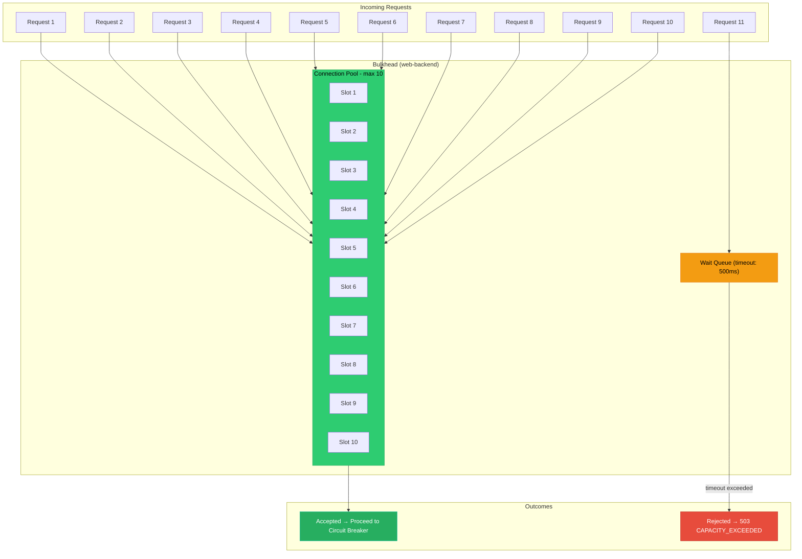
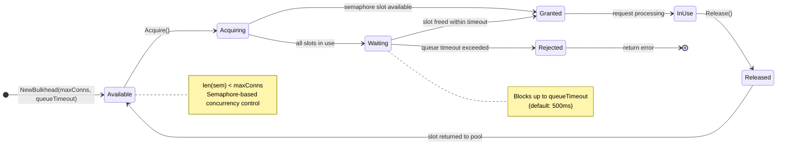
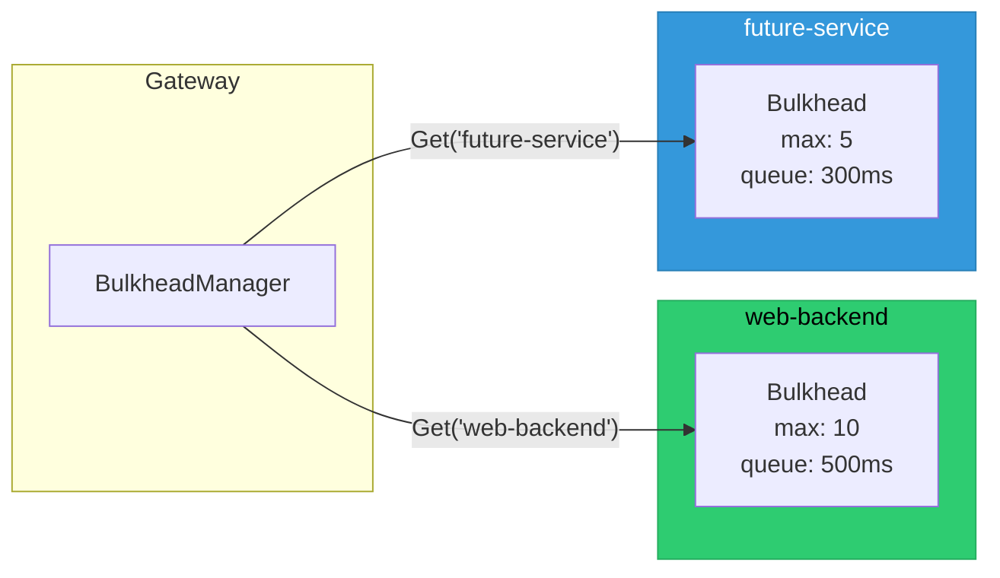

# Bulkhead Pattern Diagram

## Bulkhead Lifecycle

## Per-Service Isolation

> Each upstream service gets its own isolated bulkhead. A slow or overloaded
> service cannot starve resources from other services.
