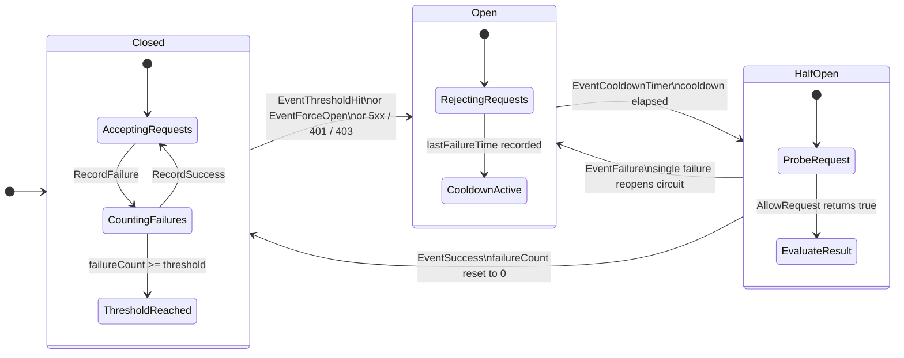
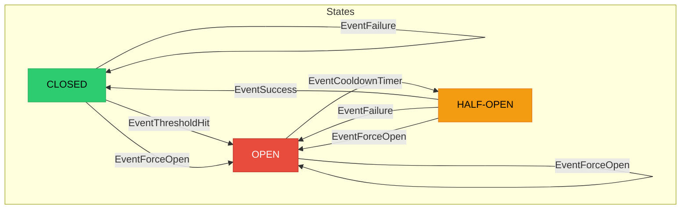

# Circuit Breaker State Machine Diagram

## FSM Transition Table

## State Descriptions

| State | Behavior | Color Code |
| --- | --- | --- |
| **CLOSED** | Normal operation. All requests flow through to the upstream service. Failures are counted until the threshold is reached. | Green |
| **OPEN** | Circuit is tripped. All requests are rejected immediately with a fail-fast response. Waits for the cooldown timeout to expire. | Red |
| **HALF-OPEN** | Probe state. A single request is allowed through to test if the upstream has recovered. Success closes the circuit; failure reopens it. | Yellow |
