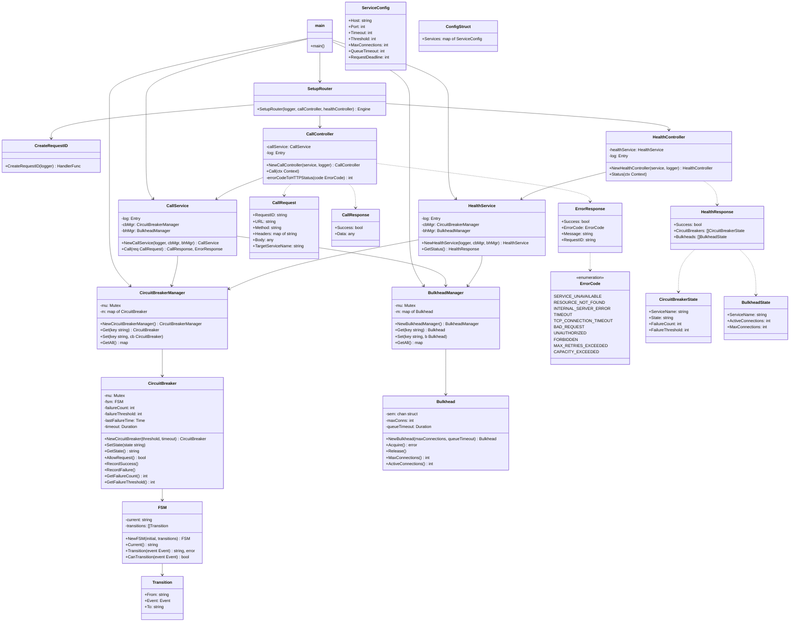

# Component / Class Diagram

```mermaid
classDiagram
    direction TB

    class main {
        +main()
    }

    class SetupRouter {
        +SetupRouter(logger, callController, healthController) Engine
    }

    class CreateRequestID {
        +CreateRequestID(logger) HandlerFunc
    }

    class CallController {
        -callService: CallService
        -log: Entry
        +NewCallController(service, logger) CallController
        +Call(ctx Context)
        -errorCodeToHTTPStatus(code ErrorCode) int
    }

    class HealthController {
        -healthService: HealthService
        -log: Entry
        +NewHealthController(service, logger) HealthController
        +Status(ctx Context)
    }

    class CallService {
        -log: Entry
        -cbMgr: CircuitBreakerManager
        -bhMgr: BulkheadManager
        +NewCallService(logger, cbMgr, bhMgr) CallService
        +Call(req CallRequest) CallResponse, ErrorResponse
    }

    class HealthService {
        -log: Entry
        -cbMgr: CircuitBreakerManager
        -bhMgr: BulkheadManager
        +NewHealthService(logger, cbMgr, bhMgr) HealthService
        +GetStatus() HealthResponse
    }

    class CircuitBreaker {
        -mu: Mutex
        -fsm: FSM
        -failureCount: int
        -failureThreshold: int
        -lastFailureTime: Time
        -timeout: Duration
        +NewCircuitBreaker(threshold, timeout) CircuitBreaker
        +SetState(state string)
        +GetState() string
        +AllowRequest() bool
        +RecordSuccess()
        +RecordFailure()
        +GetFailureCount() int
        +GetFailureThreshold() int
    }

    class CircuitBreakerManager {
        -mu: Mutex
        -m: map of CircuitBreaker
        +NewCircuitBreakerManager() CircuitBreakerManager
        +Get(key string) CircuitBreaker
        +Set(key string, cb CircuitBreaker)
        +GetAll() map
    }

    class Bulkhead {
        -sem: chan struct
        -maxConns: int
        -queueTimeout: Duration
        +NewBulkhead(maxConnections, queueTimeout) Bulkhead
        +Acquire() error
        +Release()
        +MaxConnections() int
        +ActiveConnections() int
    }

    class BulkheadManager {
        -mu: Mutex
        -m: map of Bulkhead
        +NewBulkheadManager() BulkheadManager
        +Get(key string) Bulkhead
        +Set(key string, b Bulkhead)
        +GetAll() map
    }

    class FSM {
        -current: string
        -transitions: []Transition
        +NewFSM(initial, transitions) FSM
        +Current() string
        +Transition(event Event) string, error
        +CanTransition(event Event) bool
    }

    class Transition {
        +From: string
        +Event: Event
        +To: string
    }

    class CallRequest {
        +RequestID: string
        +URL: string
        +Method: string
        +Headers: map of string
        +Body: any
        +TargetServiceName: string
    }

    class CallResponse {
        +Success: bool
        +Data: any
    }

    class ErrorResponse {
        +Success: bool
        +ErrorCode: ErrorCode
        +Message: string
        +RequestID: string
    }

    class ErrorCode {
        <<enumeration>>
        SERVICE_UNAVAILABLE
        RESOURCE_NOT_FOUND
        INTERNAL_SERVER_ERROR
        TIMEOUT
        TCP_CONNECTION_TIMEOUT
        BAD_REQUEST
        UNAUTHORIZED
        FORBIDDEN
        MAX_RETRIES_EXCEEDED
        CAPACITY_EXCEEDED
    }

    class HealthResponse {
        +Success: bool
        +CircuitBreakers: []CircuitBreakerState
        +Bulkheads: []BulkheadState
    }

    class CircuitBreakerState {
        +ServiceName: string
        +State: string
        +FailureCount: int
        +FailureThreshold: int
    }

    class BulkheadState {
        +ServiceName: string
        +ActiveConnections: int
        +MaxConnections: int
    }

    class ServiceConfig {
        +Host: string
        +Port: int
        +Timeout: int
        +Threshold: int
        +MaxConnections: int
        +QueueTimeout: int
        +RequestDeadline: int
    }

    class ConfigStruct {
        +Services: map of ServiceConfig
    }

    main --> SetupRouter
    main --> CallService
    main --> HealthService
    main --> CircuitBreakerManager
    main --> BulkheadManager

    SetupRouter --> CallController
    SetupRouter --> HealthController
    SetupRouter --> CreateRequestID

    CallController --> CallService
    HealthController --> HealthService

    CallService --> CircuitBreakerManager
    CallService --> BulkheadManager

    HealthService --> CircuitBreakerManager
    HealthService --> BulkheadManager

    CircuitBreakerManager --> CircuitBreaker
    BulkheadManager --> Bulkhead
    CircuitBreaker --> FSM
    FSM --> Transition

    CallController ..> CallRequest
    CallController ..> CallResponse
    CallController ..> ErrorResponse
    ErrorResponse ..> ErrorCode
    HealthController ..> HealthResponse
    HealthResponse ..> CircuitBreakerState
    HealthResponse ..> BulkheadState
```
