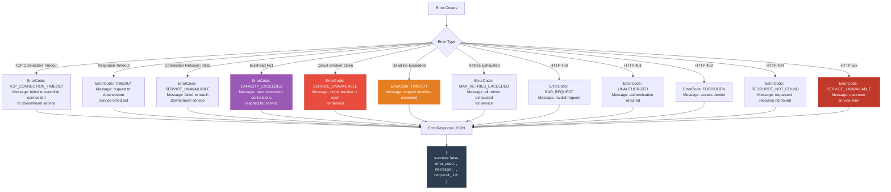
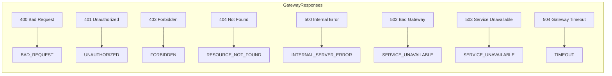
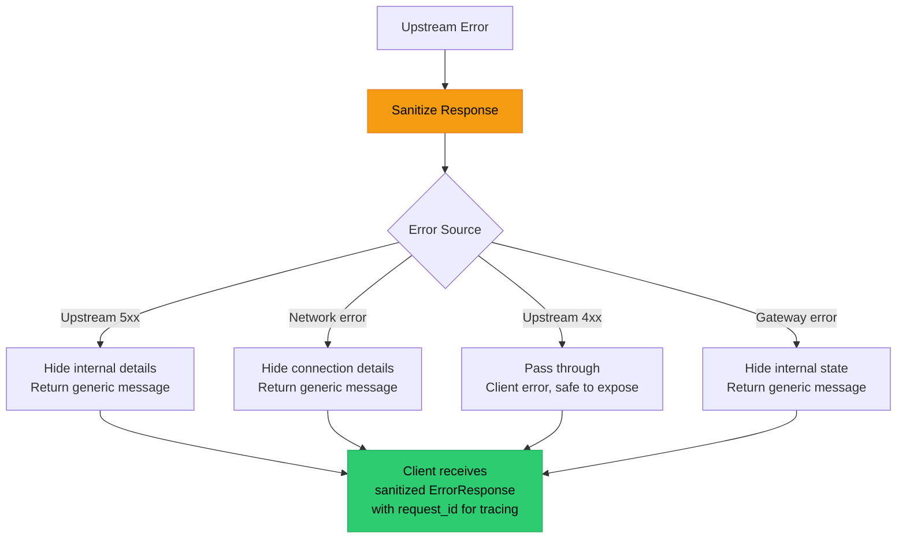

# Error Handling and Response Normalization

```mermaid
flowchart TD
    Start["Error Occurs"] --> Type{"Error Type"}

    Type -->|"TCP Connection Timeout"| TCP["ErrorCode: TCP_CONNECTION_TIMEOUT\nMessage: failed to establish connection\nto downstream service"]
    Type -->|"Response Timeout"| Timeout["ErrorCode: TIMEOUT\nMessage: request to downstream\nservice timed out"]
    Type -->|"Connection Refused / DNS"| Unavail["ErrorCode: SERVICE_UNAVAILABLE\nMessage: failed to reach\ndownstream service"]
    Type -->|"Bulkhead Full"| Capacity["ErrorCode: CAPACITY_EXCEEDED\nMessage: max concurrent connections\nreached for service"]
    Type -->|"Circuit Breaker Open"| Circuit["ErrorCode: SERVICE_UNAVAILABLE\nMessage: circuit breaker is open\nfor service"]
    Type -->|"Deadline Exceeded"| Deadline["ErrorCode: TIMEOUT\nMessage: request deadline exceeded"]
    Type -->|"Retries Exhausted"| Retries["ErrorCode: MAX_RETRIES_EXCEEDED\nMessage: all retries exhausted\nfor service"]

    Type -->|"HTTP 400"| Bad["ErrorCode: BAD_REQUEST\nMessage: invalid request"]
    Type -->|"HTTP 401"| Unauth["ErrorCode: UNAUTHORIZED\nMessage: authentication required"]
    Type -->|"HTTP 403"| Forbid["ErrorCode: FORBIDDEN\nMessage: access denied"]
    Type -->|"HTTP 404"| NotFound["ErrorCode: RESOURCE_NOT_FOUND\nMessage: requested resource not found"]
    Type -->|"HTTP 5xx"| ServerErr["ErrorCode: SERVICE_UNAVAILABLE\nMessage: upstream service error"]

    TCP --> Response["ErrorResponse JSON"]
    Timeout --> Response
    Unavail --> Response
    Capacity --> Response
    Circuit --> Response
    Deadline --> Response
    Retries --> Response
    Bad --> Response
    Unauth --> Response
    Forbid --> Response
    NotFound --> Response
    ServerErr --> Response

    Response --> Output["{\n  success: false,\n  error_code: <CODE>,\n  message: <SANITIZED>,\n  request_id: <UUID>\n}"]

    style Capacity fill:#9b59b6,stroke:#8e44ad,color:#fff
    style Circuit fill:#e74c3c,stroke:#c0392b,color:#fff
    style Deadline fill:#e67e22,stroke:#d35400,color:#fff
    style ServerErr fill:#c0392b,stroke:#e74c3c,color:#fff
    style Output fill:#2c3e50,stroke:#1a252f,color:#fff
```

## HTTP Status Code Mapping

```mermaid
graph LR
    subgraph GatewayResponses
        direction TB
        E1["400 Bad Request"] --> M1["BAD_REQUEST"]
        E2["401 Unauthorized"] --> M2["UNAUTHORIZED"]
        E3["403 Forbidden"] --> M3["FORBIDDEN"]
        E4["404 Not Found"] --> M4["RESOURCE_NOT_FOUND"]
        E5["500 Internal Error"] --> M5["INTERNAL_SERVER_ERROR"]
        E6["502 Bad Gateway"] --> M6["SERVICE_UNAVAILABLE"]
        E7["503 Service Unavailable"] --> M7["SERVICE_UNAVAILABLE"]
        E8["504 Gateway Timeout"] --> M8["TIMEOUT"]
    end
```

## Error Response Sanitization Policy

```mermaid
graph TD
    Upstream["Upstream Error"] --> Sanitize["Sanitize Response"]
    Sanitize --> Policy{"Error Source"}

    Policy -->|"Upstream 5xx"| Hide1["Hide internal details\nReturn generic message"]
    Policy -->|"Network error"| Hide2["Hide connection details\nReturn generic message"]
    Policy -->|"Upstream 4xx"| Pass1["Pass through\nClient error, safe to expose"]
    Policy -->|"Gateway error"| Hide3["Hide internal state\nReturn generic message"]

    Hide1 --> Client["Client receives\nsanitized ErrorResponse\nwith request_id for tracing"]
    Hide2 --> Client
    Pass1 --> Client
    Hide3 --> Client

    style Sanitize fill:#f39c12,stroke:#e67e22,color:#000
    style Client fill:#2ecc71,stroke:#27ae60,color:#000
```
