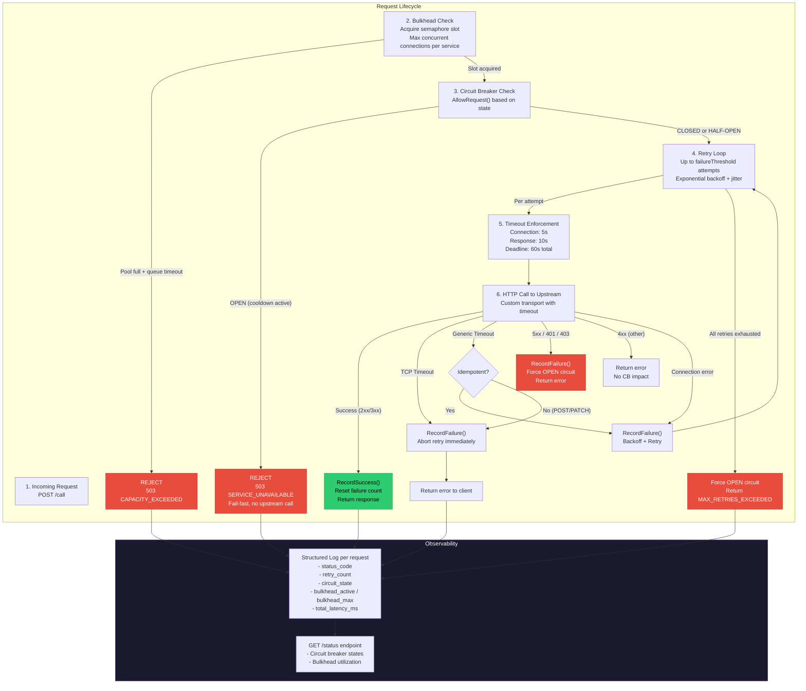

# Pattern Interaction Diagram

This diagram shows how all resilience patterns work together in the correct
order within a single request lifecycle.

## Pattern Execution Order Rationale

The order of pattern execution is critical:

1. **Bulkhead first** - Protects gateway resources. If the connection pool is
   saturated, reject immediately before spending any time on circuit breaker
   checks or retries.

2. **Circuit Breaker second** - Prevents wasted attempts. If the circuit is
   open, fail-fast without making any HTTP calls or consuming retry budget.

3. **Retry + Timeout last** - Handles transient failures. Only retry when the
   circuit is closed and there is available capacity. Retries are bounded by
   both the max attempt count and the overall request deadline.
