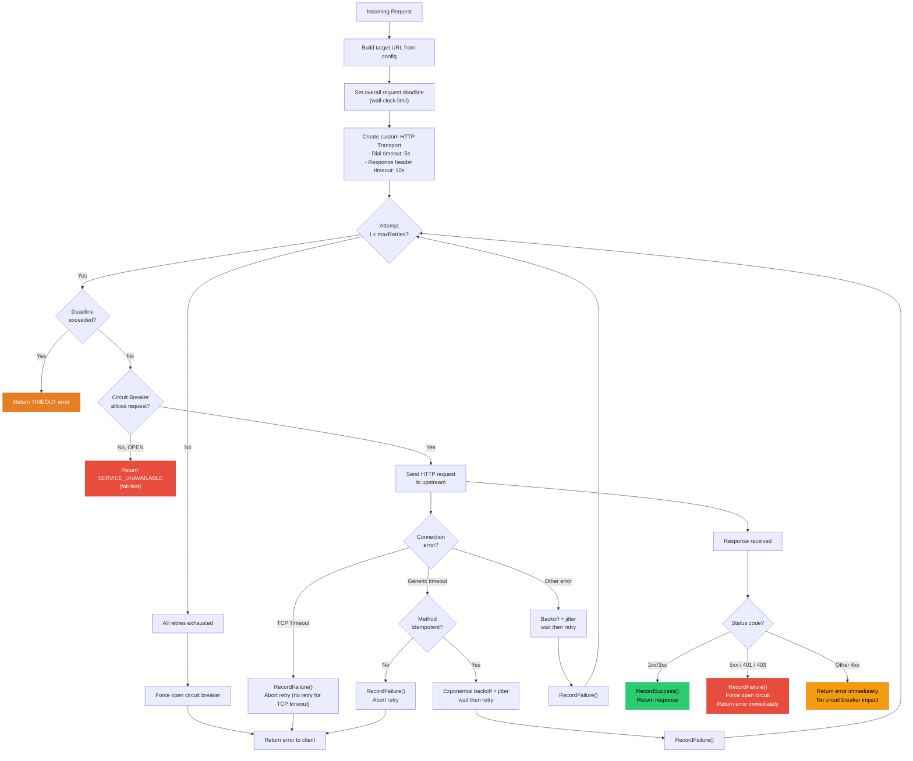
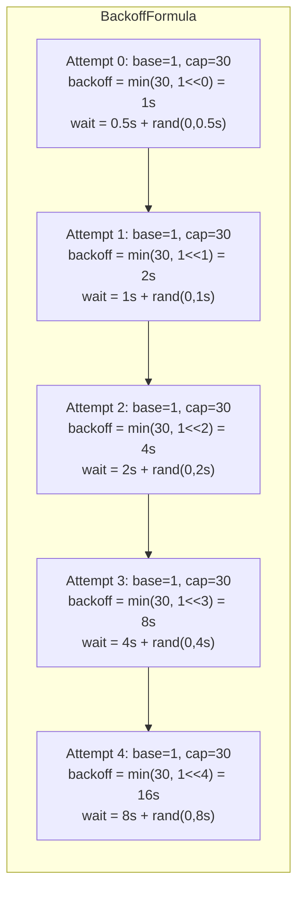
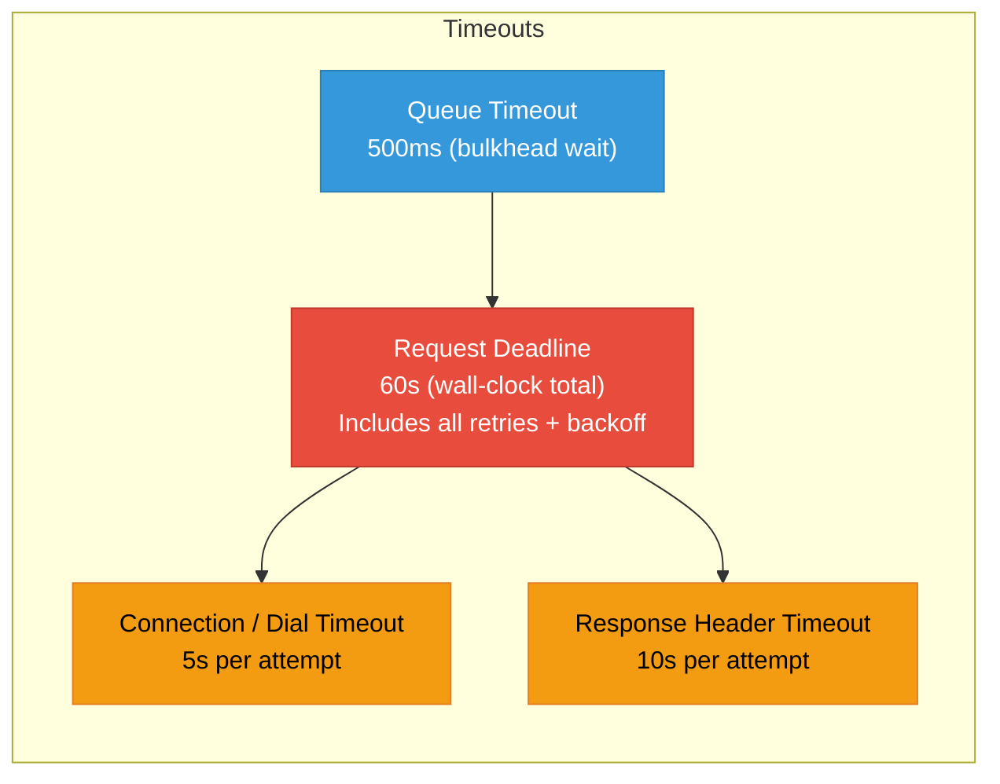

# Retry and Timeout Strategy Diagram

## Exponential Backoff with Jitter

## Timeout Hierarchy

## Idempotency Decision Table

| HTTP Method | Idempotent | Retryable on Timeout |
| --- | --- | --- |
| GET | Yes | Yes |
| PUT | Yes | Yes |
| DELETE | Yes | Yes |
| HEAD | Yes | Yes |
| OPTIONS | Yes | Yes |
| POST | No | No (abort immediately) |
| PATCH | No | No (abort immediately) |
