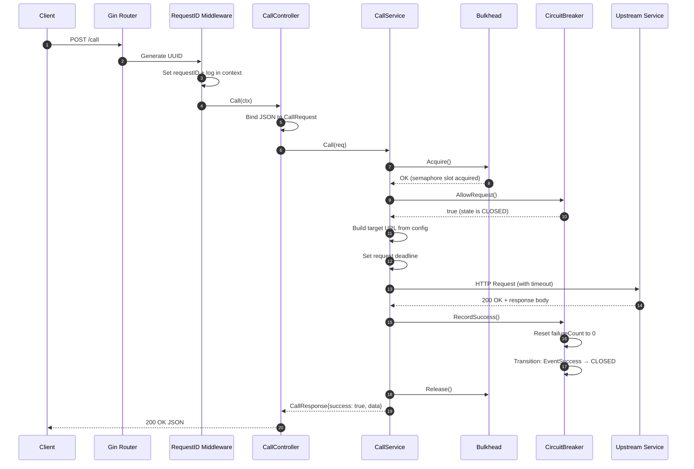
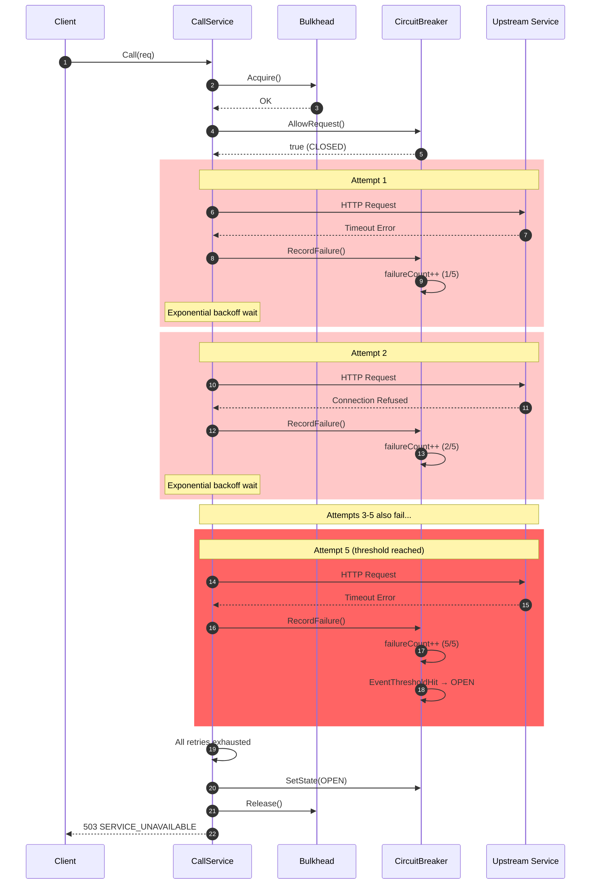
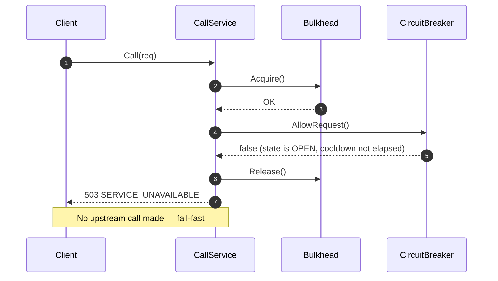
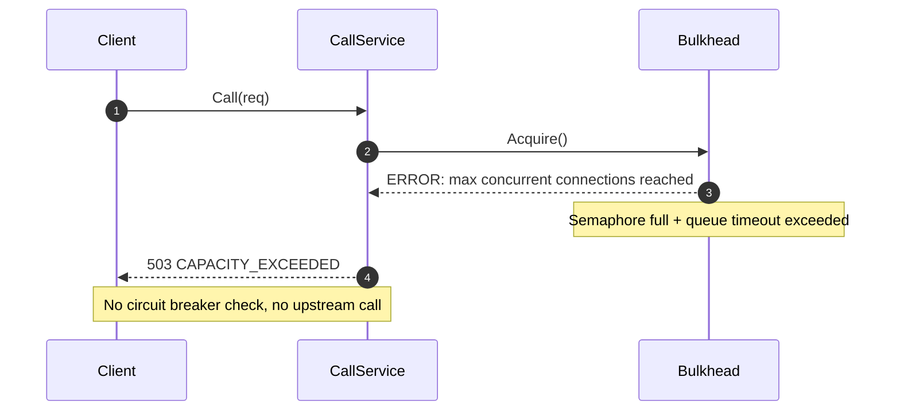
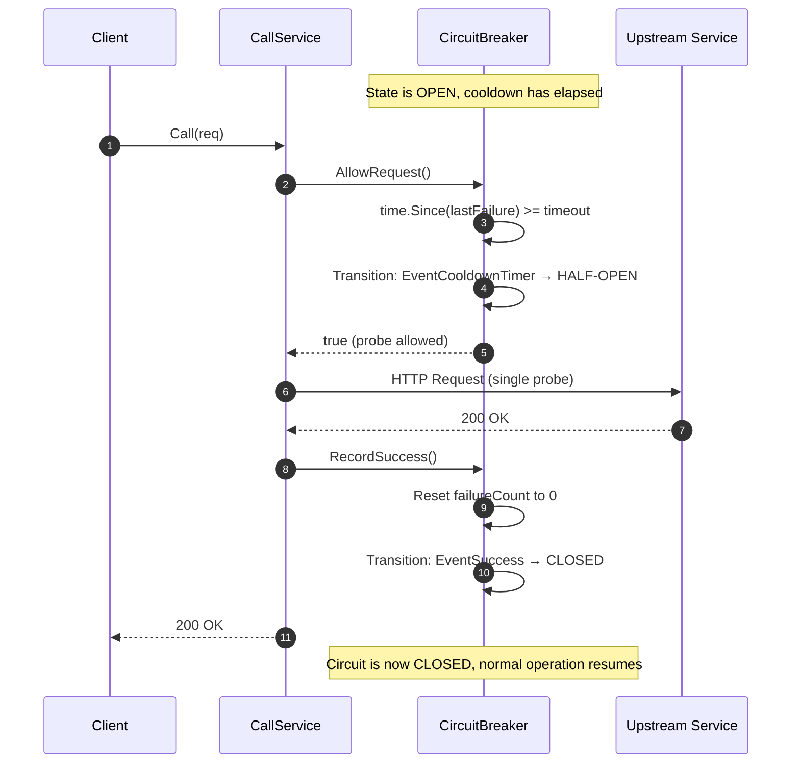

# Request Processing Sequence Diagram

## Successful Request Flow

## Request with Retries and Circuit Breaker Opening

## Circuit Breaker Rejecting Requests (Fail-Fast)

## Bulkhead Rejection

## Half-Open Recovery Flow

