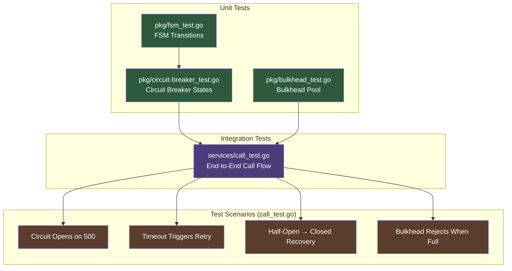
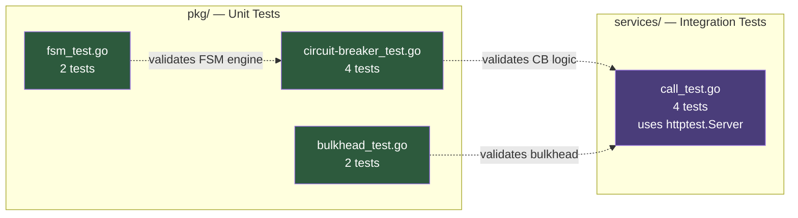
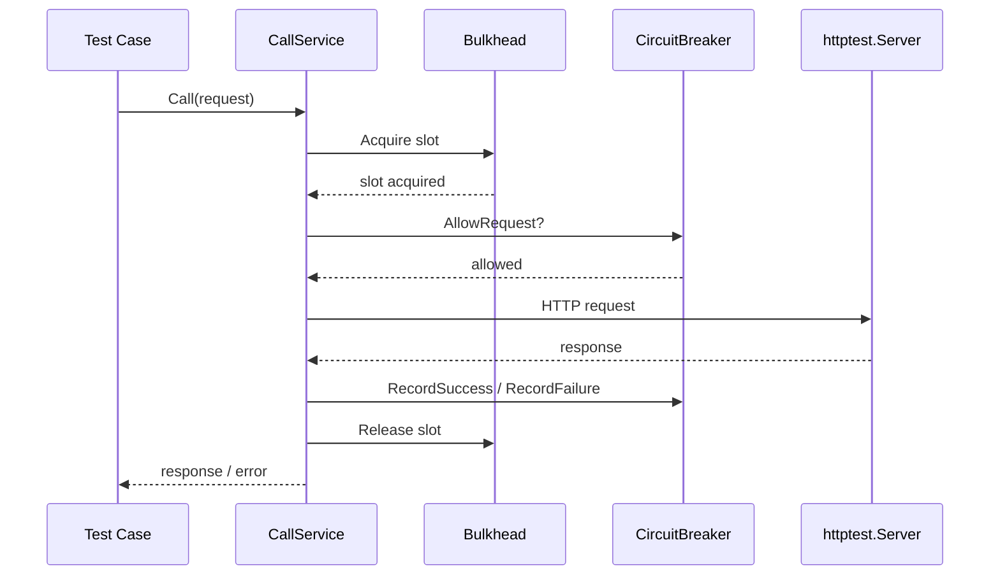

# Testing Strategy

```mermaid
graph TB
    subgraph "Unit Tests"
        FSM["pkg/fsm_test.go<br/>FSM Transitions"]
        CB["pkg/circuit-breaker_test.go<br/>Circuit Breaker States"]
        BH["pkg/bulkhead_test.go<br/>Bulkhead Pool"]
    end

    subgraph "Integration Tests"
        CS["services/call_test.go<br/>End-to-End Call Flow"]
    end

    subgraph "Test Scenarios (call_test.go)"
        T1["Circuit Opens on 500"]
        T2["Timeout Triggers Retry"]
        T3["Half-Open → Closed Recovery"]
        T4["Bulkhead Rejects When Full"]
    end

    FSM --> CB
    CB --> CS
    BH --> CS
    CS --> T1
    CS --> T2
    CS --> T3
    CS --> T4

    style FSM fill:#2d5a3d,color:#fff
    style CB fill:#2d5a3d,color:#fff
    style BH fill:#2d5a3d,color:#fff
    style CS fill:#4a3d7a,color:#fff
    style T1 fill:#5a3d2d,color:#fff
    style T2 fill:#5a3d2d,color:#fff
    style T3 fill:#5a3d2d,color:#fff
    style T4 fill:#5a3d2d,color:#fff
```

## Test Coverage by Component

```mermaid
graph LR
    subgraph "pkg/ — Unit Tests"
        U1["fsm_test.go<br/>2 tests"]
        U2["circuit-breaker_test.go<br/>4 tests"]
        U3["bulkhead_test.go<br/>2 tests"]
    end

    subgraph "services/ — Integration Tests"
        I1["call_test.go<br/>4 tests<br/>uses httptest.Server"]
    end

    U1 -.->|"validates FSM engine"| U2
    U2 -.->|"validates CB logic"| I1
    U3 -.->|"validates bulkhead"| I1

    style U1 fill:#2d5a3d,color:#fff
    style U2 fill:#2d5a3d,color:#fff
    style U3 fill:#2d5a3d,color:#fff
    style I1 fill:#4a3d7a,color:#fff
```

## Integration Test Flow

```mermaid
sequenceDiagram
    participant Test as Test Case
    participant CS as CallService
    participant BH as Bulkhead
    participant CB as CircuitBreaker
    participant Mock as httptest.Server

    Test->>CS: Call(request)
    CS->>BH: Acquire slot
    BH-->>CS: slot acquired
    CS->>CB: AllowRequest?
    CB-->>CS: allowed
    CS->>Mock: HTTP request
    Mock-->>CS: response
    CS->>CB: RecordSuccess / RecordFailure
    CS->>BH: Release slot
    CS-->>Test: response / error
```
